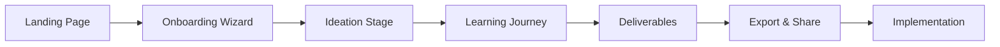

# 🗺️ ALF Coach Complete System Flow
## From Landing to Launch: The Full Project-Based Learning Journey

---

## System Overview



---

## Stage 1: Entry & Onboarding

### 1.1 Landing Page
**Purpose**: Convert visitors into users with clear value proposition

**User Actions**:
- View hero message: "Transform Learning Through Real-World Projects"
- Watch demo video (optional)
- Click "Get Started" or "Sign In"
- Or explore "See Examples" / "How It Works"

**System Response**:
- New users → Onboarding Wizard
- Returning users → Dashboard with previous projects
- Examples → Template gallery

**Technical Flow**:
```typescript
if (user.isAuthenticated) {
  redirect('/dashboard')
} else {
  redirect('/wizard/welcome')
}
```

### 1.2 Onboarding Wizard
**Purpose**: Gather context for personalized project generation

**Step-by-Step Flow**:

#### Screen 1: Vision Selection
```
"What's your teaching vision?"
○ Student-led (Progressive)
○ Balanced (Mix of approaches)  
○ Traditional (Structured)
○ Tech-forward (Digital-first)
○ Playful (Elementary-focused)
○ Inclusive (Differentiated)
○ I need guidance → [Shows tooltip overlay]
```

**Data Captured**: `wizardData.vision`

#### Screen 2: Subject Input
```
"What subject(s) are you teaching?"
[Text input field]
Examples: "AP Biology", "7th Grade Math", "Integrated Elementary"
```

**Data Captured**: `wizardData.subject`

#### Screen 3: Age Group
```
"Select your students' age range:"
○ Ages 5-7 (K-2)
○ Ages 8-10 (3-5)
○ Ages 11-14 (6-8)
○ Ages 15-18 (9-12)
○ Ages 14-21 (Mixed/Special Ed)
○ Mixed ages [Shows additional input]
```

**Data Captured**: `wizardData.ageGroup`

#### Screen 4: Duration
```
"How long will this project run?"
○ 1-2 weeks (Short sprint)
○ 2-3 weeks (Standard)
○ 3-4 weeks (Extended)
○ 4-5 weeks (Deep dive)
○ 5-6 weeks (Comprehensive)
○ Full semester
```

**Data Captured**: `wizardData.duration`

#### Screen 5: Class Size
```
"How many students?"
○ < 10 (Small group)
○ 10-20 (Typical)
○ 20-30 (Full class)
○ 30+ (Large class)
○ Variable (Multiple sections)
```

**Data Captured**: `wizardData.groupSize`

#### Screen 6: Learning Environment
```
"Where will learning happen?"
○ Classroom-based
○ Lab/Makerspace
○ Community-based
○ Virtual/Remote
○ Mixed/Hybrid
```

**Data Captured**: `wizardData.location`

#### Screen 7: Available Resources
```
"What materials and resources do you have access to?"
[Large text area]
"Consider: Technology, supplies, community partners, field trip possibilities..."
```

**Data Captured**: `wizardData.resources`

**Completion**: 
- Progress bar shows 100%
- "Continue to Ideation" button appears
- Data saves to `blueprintDoc.wizard`

---

## Stage 2: Ideation

### 2.1 Big Idea Generation
**Purpose**: Establish the conceptual foundation

**Interface**:
```
┌────────────────────────────────────────┐
│ "What's the big idea driving this      │
│  project?"                              │
│                                         │
│ [Text input area                    ]   │
│                                         │
│ [💡 Ideas] [🎲 What If] [❓ Help]      │
└────────────────────────────────────────┘
```

**Interaction Flow**:

1. **Direct Input Path**:
   - User types their big idea
   - System validates (min 10 characters)
   - "Continue" button activates

2. **Ideas Path** (Most Common):
   - User clicks "Ideas"
   - 4 suggestion cards appear:
   ```
   ┌─────────────┐ ┌─────────────┐
   │ Suggestion 1│ │ Suggestion 2│
   └─────────────┘ └─────────────┘
   ┌─────────────┐ ┌─────────────┐
   │ Suggestion 3│ │ Suggestion 4│
   └─────────────┘ └─────────────┘
   ```
   - User can:
     - Select one as-is
     - Select and modify
     - Request new suggestions
     - Type their own instead

3. **What If Path** (Ambitious):
   - User clicks "What If?"
   - 3 provocative suggestions appear
   - Pushes beyond conventional thinking

4. **Help Path** (Guidance):
   - User clicks "Help"
   - Chat assistant provides scaffolding
   - "Think about what truth you want students to discover..."

**Data Flow**:
```javascript
handleBigIdea(input) {
  validateInput(input)
  blueprintDoc.ideation.bigIdea = input
  saveToFirebase()
  advanceToNextStep()
}
```

### 2.2 Essential Question
**Purpose**: Frame the inquiry that drives learning

**Interface**: Similar to Big Idea with context-aware suggestions

**Suggestion Generation**:
- AI considers the Big Idea
- Generates questions that:
  - Are open-ended
  - Connect to real world
  - Promote critical thinking
  - Align with age group

### 2.3 Challenge Statement
**Purpose**: Define the real-world application

**Additional Features**:
- "Make it Local" button - connects to community
- "Add Audience" - specifies who benefits
- "Scale It" - adjusts complexity

**Validation**:
- Must include action verb
- Must specify deliverable
- Must identify audience/purpose

---

## Stage 3: Learning Journey

### 3.1 Phase Selection (Multi-Select)
**Purpose**: Structure the learning progression

**Interface**:
```
┌─────────────────────────────────────────┐
│ Design Your Learning Journey            │
│ Select 2-5 phases for your project      │
│                                          │
│ ☐ Phase 1: Research & Discovery         │
│    Explore the problem space...         │
│                                          │
│ ☐ Phase 2: Design & Planning            │
│    Develop solutions...                 │
│                                          │
│ ☐ Phase 3: Build & Create               │
│    Bring ideas to life...               │
│                                          │
│ ☐ Phase 4: Test & Refine                │
│    Iterate based on feedback...         │
│                                          │
│ [Continue with 2 phases] [🔄 Different] │
└─────────────────────────────────────────┘
```

**Interaction Patterns**:
- Click to select/deselect
- Drag to reorder
- Minimum 2, maximum 5
- Visual feedback for selection count
- Order matters (numbered badges appear)

### 3.2 Activity Builder (Accumulator)
**Purpose**: Populate phases with concrete activities

**Interface**:
```
┌──────────────────┬──────────────────────┐
│ Your Activities  │ Suggested Activities │
│ (3 selected)     │                      │
│                  │ [+] Interview experts│
│ 1. Field study   │ [+] Build prototype  │
│    [x] Remove    │ [+] Data collection  │
│                  │ [+] Peer review      │
│ 2. Lab analysis  │ [+] Present findings │
│    [x] Remove    │                      │
│                  │ [🔄 More Ideas]      │
│ 3. Report writing│                      │
│    [x] Remove    │                      │
│                  │                      │
│ [✓ Continue]     │                      │
└──────────────────┴──────────────────────┘
```

**Features**:
- Add/remove activities dynamically
- See running count
- Reorder by dragging
- Add custom activities
- Get contextual suggestions

### 3.3 Resource Selection
**Purpose**: Identify materials and support needed

**Current State**: Single-select (being improved)
**Future State**: Multi-select accumulator like activities

---

## Stage 4: Deliverables

### 4.1 Milestones
**Purpose**: Define progress checkpoints

**Interface**: Timeline view with draggable milestones
```
Week 1 ─────● Research Complete
Week 2 ─────● Prototype Ready  
Week 3 ─────● Testing Done
Week 4 ─────● Final Presentation
```

### 4.2 Rubric Builder
**Purpose**: Create assessment criteria

**Interface**:
```
┌─────────────────────────────────────────┐
│ Assessment Criteria                     │
│                                          │
│ ☑ Content Knowledge    [Customize ▼]    │
│ ☑ Critical Thinking    [Customize ▼]    │
│ ☑ Collaboration        [Customize ▼]    │
│ ☑ Communication        [Customize ▼]    │
│ ☐ Add Custom Criterion [+]              │
│                                          │
│ Each criterion has 4 levels:            │
│ [Emerging|Developing|Proficient|Expert] │
└─────────────────────────────────────────┘
```

### 4.3 Authentic Audience
**Purpose**: Identify who will experience student work

**Smart Features**:
- Suggests based on project type
- Validates feasibility
- Offers virtual alternatives
- Connects to community database

### 4.4 Sharing Method
**Purpose**: Define how work reaches audience

**Options Generated Based On**:
- Audience selected
- Available resources
- Age appropriateness
- Digital/physical preferences

---

## Stage 5: Completion & Export

### 5.1 Blueprint Summary
**Purpose**: Review and confirm complete project

**Interface**:
```
┌─────────────────────────────────────────┐
│ 🎉 Your Blueprint is Complete!          │
│                                          │
│ Project: [Title]                        │
│ Duration: 4 weeks                       │
│ Students: 25 (Ages 14-16)               │
│                                          │
│ ● Big Idea                              │
│ ● Essential Question                    │
│ ● Challenge                             │
│ ● 4 Phases                              │
│ ● 7 Activities                          │
│ ● 5 Resources                           │
│ ● 3 Milestones                          │
│ ● Rubric with 5 criteria                │
│ ● Authentic audience identified         │
│                                          │
│ [📄 Teacher Guide] [📚 Student Guide]   │
│ [📤 Share] [📋 Copy Link] [✏️ Edit]    │
└─────────────────────────────────────────┘
```

### 5.2 Export Options

#### Teacher Implementation Guide (PDF)
**Contains**:
- Complete project overview
- Day-by-day implementation schedule
- Resource preparation checklist
- Assessment rubrics and tools
- Differentiation strategies
- Troubleshooting guide
- Extension activities
- Standards alignment

#### Student Project Guide (PDF)
**Contains**:
- Project introduction (student-friendly)
- Essential question and challenge
- Phase descriptions and timelines
- Activity instructions
- Resources and tools
- Milestone checklist
- Rubric (student version)
- Reflection prompts

#### Additional Exports:
- Google Docs format
- Canvas/LMS import file
- Share as template
- Team collaboration link

---

## Data Persistence & State Management

### Firebase Structure:
```
blueprints/
  └── {blueprintId}/
      ├── metadata/
      │   ├── createdAt
      │   ├── updatedAt
      │   ├── userId
      │   └── shareSettings
      ├── wizard/
      │   └── [all wizard data]
      ├── ideation/
      │   ├── bigIdea
      │   ├── essentialQuestion
      │   └── challenge
      ├── journey/
      │   ├── phases[]
      │   ├── activities[]
      │   └── resources[]
      ├── deliverables/
      │   ├── milestones[]
      │   ├── rubric{}
      │   └── impact{}
      └── chat/
          └── messages[]
```

### State Flow:
```typescript
// SOPFlowManager handles state transitions
currentState = {
  currentStage: 'JOURNEY',
  currentStep: 'JOURNEY_PHASES',
  stageStep: 1,
  blueprintDoc: {...},
  canAdvance: boolean
}

// Each interaction updates state
updateStepData(data) -> 
  validateData() -> 
  saveToFirebase() -> 
  checkCanAdvance() -> 
  updateUI()
```

---

## Error Handling & Recovery

### Validation Points:
1. **Input Validation**: Each field has requirements
2. **Progress Validation**: Can't skip required steps
3. **Save Validation**: Ensures data persists
4. **Export Validation**: Checks completeness

### Recovery Mechanisms:
- Auto-save every 30 seconds
- Local storage backup
- Session recovery on refresh
- Undo last action
- Reset current stage
- Contact support integration

---

## Analytics & Improvement

### Tracked Metrics:
- Time per stage
- Suggestion acceptance rate
- Help feature usage
- Export completion rate
- Template sharing frequency
- Return user rate

### Continuous Improvement:
- A/B testing suggestion algorithms
- User feedback integration
- Template popularity analysis
- Success story collection
- Feature request pipeline

---

## Conclusion

This complete system flow demonstrates how ALF Coach transforms the complex process of project-based learning design into an intuitive, guided experience. Each stage builds upon the previous, with multiple support levels ensuring every teacher—regardless of experience—can create meaningful, engaging projects for their students.

The system's strength lies in its balance of structure and flexibility, guidance and autonomy, efficiency and thoroughness. In under 30 minutes, a teacher can go from blank page to complete, professional project blueprint ready for classroom implementation.

---

*System Architecture Documentation*
*ALF Coach Development Team*
*Version 3.0 - January 2025*