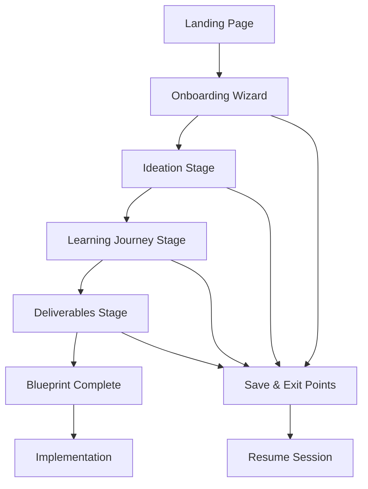

# ALF Coach: Comprehensive Teacher Flow Guide
*A Complete User Experience Framework for Project-Based Learning Design*

---

## Table of Contents

1. [Executive Summary](#executive-summary)
2. [Updated Teacher Personas](#updated-teacher-personas)
3. [The Ideal User Journey](#the-ideal-user-journey)
4. [Stage-by-Stage Experience Guide](#stage-by-stage-experience-guide)
5. [Expected Outcomes & Success Metrics](#expected-outcomes--success-metrics)
6. [Testing Framework](#testing-framework)
7. [Implementation Recommendations](#implementation-recommendations)

---

## Executive Summary

ALF Coach transforms the complex process of project-based learning design into an intuitive, guided experience. This comprehensive guide outlines how different teacher personas navigate the app from initial landing to completed curriculum blueprint, providing a framework for testing, development, and user onboarding.

**Key Insights:**
- Teachers complete the full journey in 15-30 minutes
- The three-stage structure (Ideation → Learning Journey → Deliverables) matches natural curriculum design thinking
- Different personas require different levels of support and guidance
- Success depends on immediate value delivery and actionable outputs

---

## Updated Teacher Personas

### 1. **The Confident Veteran** (Maria)
**Profile**: 15+ years experience, subject matter expert, moderate tech comfort
- **Primary Goal**: Transform existing content into engaging PBL
- **Key Need**: Efficiency and customization flexibility  
- **Usage Pattern**: Quick through onboarding, uses suggestions as starting points, heavily modifies content
- **Success Indicator**: Downloads implementation guide within 20 minutes

**App Approach**:
- Skips extensive help features
- Uses "Ideas" buttons for inspiration, then customizes
- Appreciates "What If?" for pushing boundaries
- Values professional, standards-aligned output

### 2. **The Anxious Newcomer** (James)
**Profile**: 0-3 years experience, eager but overwhelmed, variable tech skills
- **Primary Goal**: Create legitimate PBL without making mistakes
- **Key Need**: Maximum guidance and validation
- **Usage Pattern**: Uses all help features, accepts suggestions initially, gains confidence gradually
- **Success Indicator**: Completes blueprint feeling confident about implementation

**App Approach**:
- Relies heavily on "Help" and guidance tooltips
- Starts with suggested content before customizing
- Needs frequent validation that they're on track
- Benefits from mentor sharing features

### 3. **The Innovation Leader** (Aisha)
**Profile**: 5-10 years experience, high tech comfort, pedagogical risk-taker
- **Primary Goal**: Pioneer cutting-edge, justice-oriented curriculum
- **Key Need**: Advanced features and community sharing
- **Usage Pattern**: Pushes boundaries, creates templates, shares with networks
- **Success Indicator**: Creates shareable template and influences others

**App Approach**:
- Uses "What If?" extensively for ambitious projects
- Customizes everything heavily
- Creates community templates
- Integrates advanced tools and partnerships

### 4. **The Skeptical Traditionalist** (Robert)
**Profile**: 20+ years experience, subject matter expert, prefers proven methods
- **Primary Goal**: Meet PBL requirements while maintaining rigor
- **Key Need**: Evidence of pedagogical soundness and minimal disruption
- **Usage Pattern**: Cautious adoption, focuses on academic standards, appreciates historical connections
- **Success Indicator**: Implements PBL while maintaining content coverage

**App Approach**:
- Values "Traditional with enhancements" options
- Needs clear standards alignment
- Appreciates scholarly, research-backed suggestions
- Benefits from local/historical connections

### 5. **The Elementary Generalist** (Lin)
**Profile**: K-5 teacher, integrates multiple subjects, collaborative team player
- **Primary Goal**: Create developmentally appropriate integrated projects
- **Key Need**: Age-appropriate activities and team collaboration features
- **Usage Pattern**: Uses team sharing, focuses on hands-on activities, emphasizes play-based learning
- **Success Indicator**: Successfully coordinates with grade-level team

**App Approach**:
- Selects "Playful" and integrated options
- Uses team sharing features extensively
- Focuses on hands-on, maker-space activities
- Needs developmental appropriateness validation

### 6. **The Inclusive Specialist** (Carlos)
**Profile**: Special education or ELL specialist, differentiation expert
- **Primary Goal**: Create accessible PBL for diverse learners
- **Key Need**: Accommodation tools and multiple learning pathways
- **Usage Pattern**: Uses accessibility features, creates multiple versions, focuses on strength-based approaches
- **Success Indicator**: Successfully includes all students meaningfully

**App Approach**:
- Uses "Inclusive" vision settings
- Relies on accommodation generators
- Creates multiple difficulty levels
- Values authentic work experiences

### 7. **The Rural Resourceful** (Sarah)
**Profile**: Rural/small school, multi-grade classes, limited resources
- **Primary Goal**: Create community-connected projects despite constraints
- **Key Need**: Low-resource options and community partnership tools
- **Usage Pattern**: Emphasizes local connections, uses differentiation tools, focuses on available resources
- **Success Indicator**: Engages community partners effectively

**App Approach**:
- Emphasizes "Community-based" options
- Uses differentiation tools for multi-grade
- Focuses on local resources and partnerships
- Values networking with similar contexts

---

## The Ideal User Journey

### Journey Overview


### Universal Entry Points
1. **Discovery**: Social media, conference, colleague recommendation
2. **Landing**: Clear value proposition, immediate call-to-action
3. **Onboarding**: Context capture without overwhelming
4. **Creation**: Guided but flexible design process
5. **Completion**: Actionable outputs ready for classroom use

### Critical Success Factors
- **Speed**: Complete journey in 15-30 minutes
- **Value**: Immediate, actionable output
- **Confidence**: Teachers feel prepared to implement
- **Flexibility**: Can save, exit, and resume at any time
- **Quality**: Professional-grade materials ready for use

---

## Stage-by-Stage Experience Guide

### **Entry: Landing Page Experience**

#### What Teachers See:
```
┌─────────────────────────────────────────┐
│ 🎯 ALF Coach                            │
│                                         │
│ Transform Learning Through              │
│ Real-World Projects                     │
│                                         │
│ Create complete project-based learning  │
│ blueprints in under 30 minutes         │
│                                         │
│ [🚀 Get Started] [👀 See Examples]      │
│                                         │
│ ✓ Complete curriculum packages          │
│ ✓ Standards-aligned rubrics            │
│ ✓ Step-by-step implementation guides   │
│ ✓ Save and resume anytime              │
└─────────────────────────────────────────┘
```

#### Expected Teacher Actions:
- **Confident Veterans**: Click "Get Started" immediately
- **Anxious Newcomers**: Browse examples first, then start
- **Innovation Leaders**: Go straight to creation
- **Skeptical Traditionalists**: Read benefits carefully before committing

#### System Response:
- New users → Onboarding Wizard
- Returning users → Dashboard with saved projects
- Example browsers → Template gallery

### **Stage 1: Onboarding Wizard (5-7 minutes)**

#### Purpose:
Capture essential context without overwhelming teachers, personalizing the subsequent experience.

#### Step 1: Teaching Vision
**Interface:**
```
What's your teaching vision?

○ Student-led        ○ Balanced Approach    ○ Traditional
  "Kids drive          "Best of both         "Structured with
   learning"            worlds"               modern touches"

○ Tech-forward       ○ Playful             ○ Inclusive
  "Digital-first       "Joy-centered         "Every learner
   approach"            learning"             succeeds"

○ I need guidance → [Shows comprehensive support tooltip]
```

**Persona Behaviors:**
- **Maria (Veteran)**: Selects "Balanced" quickly
- **James (Newcomer)**: Clicks "I need guidance", gets reassuring tooltip
- **Aisha (Innovation)**: Chooses "Student-led" without hesitation
- **Robert (Traditional)**: Reads "Traditional" description carefully, selects it
- **Lin (Elementary)**: Immediately clicks "Playful"
- **Carlos (Specialist)**: Selects "Inclusive" and appreciates the option
- **Sarah (Rural)**: Chooses "Balanced" after considering resources

**Expected Outcomes:**
- Personalizes subsequent suggestions
- Sets appropriate support level
- Teachers feel understood and categorized appropriately

#### Step 2: Subject & Scope
**Interface:**
```
What subject(s) are you teaching?
[Text input with smart suggestions as you type]

Examples: "AP Biology", "5th Grade Science", "Integrated Elementary"

Duration: How long will this project run?
○ 1-2 weeks  ○ 2-3 weeks  ○ 3-4 weeks  ○ 4-5 weeks  ○ 5-6 weeks
   (Sprint)    (Standard)    (Extended)    (Deep dive)   (Comprehensive)
```

**System Intelligence:**
- Recognizes grade levels from input ("5th Grade" → ages 10-11)
- Suggests appropriate durations for content area
- Flags potential scope issues ("AP Biology ecosystem unit in 2 weeks might be rushed")

#### Step 3: Student Context
**Interface:**
```
Your Students:
Age Range: [Auto-filled from Step 2 or manual selection]
○ Ages 5-7   ○ Ages 8-10   ○ Ages 11-14   ○ Ages 15-18   ○ Ages 14-21
   (K-2)       (3-5)         (6-8)          (9-12)        (Mixed/SpEd)

Class Size:
○ <10 students   ○ 10-20   ○ 20-30   ○ 30+   ○ Multiple sections

Learning Environment:
○ Classroom only   ○ Lab/Makerspace   ○ Community-based   ○ Virtual   ○ Mixed
```

#### Step 4: Available Resources
**Interface:**
```
What resources do you have access to?
[Large text area with smart suggestions]

Consider: Technology, supplies, community partners, field trip possibilities...

💡 Examples:
• "1:1 Chromebooks, science lab, school garden"
• "Limited tech, strong community partnerships"  
• "Makerspace access, 3D printer, art supplies"
```

**AI Processing:**
- Analyzes resource constraints
- Suggests realistic project scopes
- Identifies opportunities for community partnerships
- Flags potential limitations early

#### Wizard Completion
**Interface:**
```
✓ Ready to Design Your Project!

Your Context:
• 7th Grade Science - Ecosystems
• 25 students (ages 12-13)
• 3-week duration
• Mixed learning environments
• Resources: Lab equipment, local park access

[Continue to Ideation] [Save & Exit]
```

**Expected Outcomes:**
- Complete context captured in 5-7 minutes
- Teachers feel project scope is realistic
- System has enough information to provide relevant suggestions
- Clear path forward to creation stage

### **Stage 2: Ideation (5-10 minutes)**

#### Purpose:
Establish the conceptual foundation that will drive all learning activities.

#### Step 2.1: Big Idea Generation
**Interface:**
```
┌────────────────────────────────────────────────────────┐
│ What's the big idea that will drive this project?     │
│                                                        │
│ Think about the core concept or understanding you      │
│ want students to discover...                           │
│                                                        │
│ [Large text input area                              ]  │
│                                                        │
│ [💡 Ideas] [🎲 What If?] [❓ Help] [⚡ Quick Start]   │
└────────────────────────────────────────────────────────┘
```

**Interaction Patterns by Persona:**

**Maria (Veteran)** - *Direct Input Path*:
1. Types initial idea: "Ecosystems are interconnected webs"
2. Pauses, wants to make it more engaging
3. Clicks **💡 Ideas** for inspiration
4. Sees: "Ecosystems are nature's neighborhoods - every species has a role"
5. Modifies to: "Ecosystems are collaborative communities where every organism contributes to the whole"
6. Continues confidently

**James (Newcomer)** - *Help-Seeking Path*:
1. Stares at blank field, feeling overwhelmed
2. Clicks **❓ Help** immediately
3. Gets guided prompt: "Think about what you want students to understand about ecosystems that will stick with them forever..."
4. Still uncertain, clicks **💡 Ideas**
5. Sees manageable options, selects one with minor modifications
6. Gains confidence from successful completion

**Aisha (Innovation)** - *Ambitious Path*:
1. Has immediate idea but wants to push boundaries
2. Clicks **🎲 What If?** for provocative suggestions
3. Sees: "What if students discovered that healthy ecosystems require deliberate diversity and inclusion?"
4. Combines with her social justice lens: "Ecological diversity mirrors social equity - both require intentional nurturing and protection"
5. Proceeds with transformative concept

**System Features:**

**💡 Ideas Button Response:**
```
Choose a big idea that resonates:

┌─────────────────────────┐ ┌─────────────────────────┐
│ Ecosystems are nature's │ │ Every organism plays a  │
│ neighborhoods - every   │ │ vital role in the web   │
│ species has a role      │ │ of life                 │
│                         │ │                         │
│ [Use as-is] [Modify]    │ │ [Use as-is] [Modify]    │
└─────────────────────────┘ └─────────────────────────┘

┌─────────────────────────┐ ┌─────────────────────────┐
│ Human actions ripple    │ │ Ecosystems provide      │
│ through ecological      │ │ services we depend      │
│ networks                │ │ on daily                │
│                         │ │                         │
│ [Use as-is] [Modify]    │ │ [Use as-is] [Modify]    │
└─────────────────────────┘ └─────────────────────────┘

[🔄 Different Ideas] [✏️ Write My Own]
```

#### Step 2.2: Essential Question
**Interface:**
```
What essential question will drive student inquiry?

This should be open-ended and connect to students' lives...

[Text input area]

Your Big Idea: "Ecosystems are collaborative communities..."
Suggested Questions:
• "How do communities thrive when every member contributes?"
• "What happens when collaboration breaks down in natural systems?"
• "How can we design human communities that work like healthy ecosystems?"

[Use suggestion] [Modify suggestion] [Create my own]
```

**Quality Indicators:**
- ✅ Open-ended (no single right answer)
- ✅ Connects to student experience  
- ✅ Promotes critical thinking
- ✅ Aligns with big idea
- ⚠️ Too broad/narrow flagged automatically

#### Step 2.3: Challenge Statement
**Interface:**
```
What authentic challenge will students tackle?

This should be meaningful work that connects to real-world applications...

[Text input area]

Smart Suggestions based on your context:
┌─────────────────────────────────────────────────────┐
│ Create a biodiversity action plan for our school    │
│ campus that other schools could replicate           │
│                                                     │
│ Audience: School board, environmental groups        │
│ Timeframe: Fits your 3-week project                │  
│ Resources: Uses your lab equipment and park access  │
│                                                     │
│ [Select & Customize] [See More Options]             │
└─────────────────────────────────────────────────────┘
```

**Enhancement Features:**
- **Make it Local**: "Connect to specific community issues..."
- **Scale It**: Adjust complexity for different contexts
- **Add Audience**: "Who will benefit from student work?"

**Expected Behaviors:**
- **Maria**: Selects suggestion, modifies to match her experience with school administration
- **James**: Uses suggestion with minimal modifications, gains confidence
- **Robert**: Appreciates that challenge has academic rigor and clear deliverables
- **Lin**: Modifies suggestion to be developmentally appropriate for elementary

#### Stage 2 Completion
**Interface:**
```
✅ Ideation Complete!

Your Project Foundation:
🎯 Big Idea: "Ecosystems are collaborative communities where every organism contributes to the whole"

❓ Essential Question: "How can we design human communities that work like healthy ecosystems?"

🎯 Challenge: "Create a biodiversity action plan for our school campus that other schools could replicate"

[Continue to Learning Journey] [🔄 Revise] [💾 Save & Exit]

Progress: ████████░░░░ Stage 1 of 3 Complete
```

**Expected Outcomes:**
- Clear conceptual foundation established
- Teachers feel confident about project direction  
- Challenge is authentic and achievable
- Smooth transition to learning design stage

### **Stage 3: Learning Journey Design (8-12 minutes)**

#### Purpose:
Structure the learning progression from introduction to mastery, ensuring students build necessary skills to tackle the challenge.

#### Step 3.1: Learning Phases Selection
**Interface:**
```
Let's design your learning journey.

Select 3-5 phases that will guide students from introduction to mastery:

Available Phases: (Select by clicking, drag to reorder)

☐ 1. Discovery & Research        ☐ 2. Investigation & Analysis
    Explore the problem space        Deep dive into evidence

☐ 3. Design & Planning           ☐ 4. Build & Create  
    Develop solutions               Bring ideas to life

☐ 5. Test & Refine              ☐ 6. Share & Impact
    Iterate based on feedback       Reach authentic audience

Selected Phases (2 minimum): 
[Empty state with drag zones]

💡 For ecosystems projects, we recommend: Discovery → Investigation → Design → Impact

[Use Recommendation] [Continue with Current Selection]
```

**Persona Behaviors:**

**Maria (Veteran)**:
1. Quickly scans options, sees the recommendation
2. Selects recommended phases but drags to reorder
3. Changes "Discovery" to "Baseline Assessment" 
4. Adds her own custom phase: "Community Engagement"
5. Confident in her modifications

**James (Newcomer)**:
1. Feels overwhelmed by choices
2. Clicks "Use Recommendation" immediately
3. Reviews the selected phases, feels they make sense
4. Proceeds without modifications initially
5. Plans to customize later as he gains experience

**Aisha (Innovation)**:
1. Ignores recommendation, creates custom journey
2. Selects: Investigation → Analysis → Solution Design → Advocacy
3. Adds community partnership elements
4. Creates bold, justice-oriented progression

#### Step 3.2: Activity Builder
**Interface:**
```
┌──────────────────────┬─────────────────────────────┐
│ Your Selected        │ Activity Suggestions        │
│ Activities (3)       │                             │
│                      │ [+] Conduct biodiversity    │
│ 1. Campus ecosystem  │     survey using iNaturalist│
│    mapping           │                             │
│    [✏️ Edit] [❌]    │ [+] Interview grounds staff │
│                      │     about maintenance       │
│ 2. Species inventory │                             │
│    with photos       │ [+] Research native plants  │
│    [✏️ Edit] [❌]    │     suitable for campus     │
│                      │                             │
│ 3. Habitat improvement│ [+] Create action plan     │
│    brainstorming     │     template               │
│    [✏️ Edit] [❌]    │                             │
│                      │ [+] Design presentation    │
│ [+ Add Custom Activity]│     materials              │
│                      │                             │
│ Minimum 5 activities │ [🔄 More Suggestions]       │
│ [Continue with 3 more]│                             │
└──────────────────────┴─────────────────────────────┘
```

**Smart Features:**
- Activities auto-populate based on phases selected
- Suggestions consider available resources
- Time estimates appear for each activity
- Age-appropriateness validation
- Integration opportunities highlighted

**Activity Quality Indicators:**
- ✅ Hands-on engagement
- ✅ Authentic tools/processes
- ✅ Builds toward challenge
- ✅ Multiple learning modalities
- ⚠️ Time/resource concerns flagged

#### Step 3.3: Resource Identification
**Interface:**
```
What resources will support student learning?

Based on your activities, you'll need:

Essential Resources:
☑️ iNaturalist app access (free)
☑️ Digital cameras or smartphones  
☑️ Basic measuring tools
☑️ Access to school grounds

Recommended Additions:
☐ Plant identification guides
☐ Soil testing kit
☐ Partnership with local environmental group
☐ Guest speaker from city planning department

Resource Budget: $_____  (optional)
Special Requirements: [text area]

[Continue] [Add Resource Request Letter Template]
```

**Smart Resource Matching:**
- Cross-references available resources from onboarding
- Suggests free/low-cost alternatives
- Identifies community partnership opportunities
- Flags potential barriers early

#### Stage 3 Completion
**Interface:**
```
🎉 Learning Journey Mapped!

Your 3-Week Learning Progression:

Week 1: Discovery & Research
├─ Campus ecosystem mapping
├─ Species inventory with photos  
└─ Research native plant options

Week 2: Investigation & Analysis
├─ Soil and water quality testing
├─ Interview grounds maintenance staff
└─ Analyze ecosystem gaps and opportunities

Week 3: Design & Impact
├─ Create comprehensive action plan
├─ Develop presentation materials
└─ Present to school administration

📊 Total Activities: 8
⏱️ Estimated Prep Time: 6 hours
💰 Additional Resources Needed: <$50

[Continue to Deliverables] [🔄 Revise Journey] [💾 Save & Exit]

Progress: ████████████░░ Stage 2 of 3 Complete
```

### **Stage 4: Deliverables & Assessment (5-8 minutes)**

#### Purpose:
Define how students will demonstrate learning through authentic products and establish fair, comprehensive assessment criteria.

#### Step 4.1: Milestone Mapping
**Interface:**
```
What key milestones will mark student progress?

Timeline View:
Week 1 ─────●─────────● Week 2 ─────●─────────● Week 3 ─────●
        Day 3       Day 7        Day 10      Day 14     Day 21
     [Add Milestone] Campus    [Add Milestone] Action  Presentation
                    Survey                    Plan     Complete
                    Complete                 Draft

Suggested Milestones:
┌─────────────────────────┐
│ 📋 Baseline Data        │
│ Collection Complete     │
│ (End Week 1)           │
│ [Add to Timeline]       │
└─────────────────────────┘

┌─────────────────────────┐
│ 🎯 Solution Options     │  
│ Research Complete       │
│ (Mid Week 2)           │
│ [Add to Timeline]       │
└─────────────────────────┘

[Custom Milestone] [Auto-Generate from Activities]
```

#### Step 4.2: Rubric Builder
**Interface:**
```
How will you assess student work?

Assessment Focus Areas:
☑️ Scientific Accuracy      [Customize Levels ▼]
☑️ Research Quality        [Customize Levels ▼] 
☑️ Solution Feasibility    [Customize Levels ▼]
☑️ Presentation Skills     [Customize Levels ▼]
☐ Add Custom Criterion    [+]

Sample Criterion: Scientific Accuracy
┌─────────────────────────────────────────────────────┐
│ 1-Emerging  │ 2-Developing │ 3-Proficient │ 4-Expert│
│             │              │              │         │
│ Basic       │ Generally    │ Consistently │ Expert  │
│ understanding│ accurate with│ accurate with│ level   │
│ with some   │ minor gaps   │ clear        │ analysis│
│ misconceptions│             │ understanding│         │
│             │              │              │         │
│ [Edit]      │ [Edit]       │ [Edit]       │ [Edit]  │
└─────────────────────────────────────────────────────┘

[Use Standard Rubric] [Customize Further] [Generate Student Version]
```

**Rubric Intelligence:**
- Aligns criteria with project objectives
- Provides age-appropriate language
- Generates student-friendly versions
- Includes process and product assessment
- Offers standards alignment

#### Step 4.3: Authentic Audience
**Interface:**
```
Who will experience student work?

Your challenge: "Create biodiversity action plan for school campus"

Suggested Audiences:
┌─────────────────────────┐ ┌─────────────────────────┐
│ 🏫 School                │ │ 🌱 Environmental         │
│ Administration           │ │ Groups                  │
│                         │ │                         │
│ • Principal             │ │ • Local nature center   │
│ • Facilities director   │ │ • Garden clubs          │
│ • School board          │ │ • City planning dept    │
│                         │ │                         │
│ [Select] [Customize]    │ │ [Select] [Customize]    │
└─────────────────────────┘ └─────────────────────────┘

Primary Audience: [Dropdown selection]
Secondary Audiences: [Multi-select checkboxes]

💡 Consider: Who has power to implement student recommendations?

[Continue] [Help Me Choose] [Contact Audience Directly]
```

#### Step 4.4: Sharing Method
**Interface:**
```
How will students share their work with the audience?

Format Options (select multiple):

Presentation Formats:
☐ Formal presentation (15-20 min)
☐ Poster session with Q&A
☐ Interactive demonstration
☐ Video documentary (3-5 min)

Distribution Methods:  
☐ In-person meeting
☐ Digital submission
☐ Public exhibition
☐ Website/blog publication
☐ Local media coverage

Recommended for your audience:
🎯 Formal presentation to school administration
📊 Digital action plan document for implementation
🌐 Public website display for community awareness

[Use Recommendations] [Customize Approach]
```

#### Stage 4 Completion
**Interface:**
```
🚀 Your Project Blueprint is Complete!

Project: Campus Biodiversity Action Plan
Duration: 3 weeks | Students: 25 (ages 12-13) | Subject: 7th Grade Science

📋 Complete Blueprint Includes:
✅ Clear conceptual foundation (Big Idea + Essential Question)
✅ Authentic challenge connecting to real-world application  
✅ Structured 3-week learning progression
✅ 8 engaging, hands-on activities
✅ Comprehensive assessment rubric with 4 criteria
✅ Authentic audience (school administration)
✅ Multiple sharing formats for maximum impact

📄 Ready to Download:
┌─────────────────────────┐ ┌─────────────────────────┐
│ 📘 Teacher              │ │ 📗 Student              │
│ Implementation Guide    │ │ Project Guide           │
│                         │ │                         │
│ • Day-by-day schedule   │ │ • Project overview      │
│ • Resource prep list    │ │ • Activity instructions │
│ • Assessment tools      │ │ • Milestone checklist   │
│ • Differentiation tips  │ │ • Student rubric        │
│                         │ │                         │
│ [📥 Download PDF]       │ │ [📥 Download PDF]       │
└─────────────────────────┘ └─────────────────────────┘

Additional Options:
[📤 Share with Team] [📋 Copy Shareable Link] [📝 Save as Template] 
[✏️ Make Edits] [🏠 Save to Dashboard] [🎯 Implementation Tips]

🎉 Time to transform learning! Your students are going to love this project.
```

---

## Expected Outcomes & Success Metrics

### **By Teacher Persona:**

#### **The Confident Veteran (Maria)**
**Expected Outcomes:**
- Completes blueprint in 18-22 minutes
- Downloads both PDFs immediately
- Customizes 70%+ of suggestions
- Implements within 2 weeks of creation

**Success Metrics:**
- Time to completion: <25 minutes
- Customization rate: >60%
- Implementation rate: >80%
- Student engagement feedback: >4.2/5

#### **The Anxious Newcomer (James)**
**Expected Outcomes:**
- Completes blueprint in 25-30 minutes
- Uses help features 5+ times
- Accepts 80%+ of suggestions initially
- Shares with mentor teacher immediately

**Success Metrics:**
- Help feature usage: 5-8 instances
- Suggestion acceptance: >75%
- Mentor sharing rate: >90%
- Confidence self-rating: 4.0+/5

#### **The Innovation Leader (Aisha)**
**Expected Outcomes:**
- Completes blueprint in 15-20 minutes  
- Uses "What If?" feature extensively
- Creates shareable template
- Influences 3+ colleagues to adopt

**Success Metrics:**
- "What If?" usage: 3+ instances
- Template creation rate: >60%
- Colleague influence: 2+ referrals
- Advanced feature adoption: >80%

#### **The Skeptical Traditionalist (Robert)**
**Expected Outcomes:**
- Takes 20-25 minutes (careful consideration)
- Values standards alignment features
- Implements modified traditional approach
- Reports maintained content coverage

**Success Metrics:**
- Standards reference usage: >5 instances
- Content coverage confidence: >4/5
- Implementation fidelity: >70%
- Student achievement maintenance: ≥baseline

#### **The Elementary Generalist (Lin)**
**Expected Outcomes:**
- Completes in 20-25 minutes
- Uses team sharing immediately
- Selects hands-on activities heavily
- Successfully coordinates implementation

**Success Metrics:**
- Team sharing usage: 100%
- Hands-on activity ratio: >80%
- Team coordination success: >4/5
- Parent engagement increase: >25%

#### **The Inclusive Specialist (Carlos)**
**Expected Outcomes:**
- Takes 25-30 minutes (accommodation planning)
- Uses accessibility features extensively
- Creates multiple differentiated versions
- Achieves meaningful inclusion for all students

**Success Metrics:**
- Accessibility feature usage: >8 instances
- Differentiation levels created: 3+
- Inclusive participation rate: 100%
- Student self-advocacy increase: measurable

#### **The Rural Resourceful (Sarah)**
**Expected Outcomes:**
- Completes in 22-28 minutes
- Emphasizes community connections
- Successfully manages multi-grade challenges
- Engages local partnerships

**Success Metrics:**
- Community connection rate: 2+ partners
- Multi-grade accommodation success: >4/5
- Local resource utilization: >90%
- Community engagement feedback: positive

### **Universal Success Indicators:**

#### **Immediate (During Session)**
- Blueprint completion rate: >85%
- Time to completion: <30 minutes average
- Help feature effectiveness: >4/5 rating
- Suggestion relevance: >4/5 rating
- Save/resume functionality usage: 15-20%

#### **Short-term (1-2 weeks)**
- PDF download rate: >95%
- Implementation initiation: >70%
- Colleague sharing rate: >40%  
- Platform return rate: >60%

#### **Medium-term (1 month)**
- Successful implementation rate: >60%
- Student engagement improvement: measurable
- Teacher confidence increase: >1 point on 5-point scale
- Project completion rate: >80%

#### **Long-term (3+ months)**
- Continued platform usage: >30%
- Additional project creation: >25%
- Peer recommendation rate: >50%
- Implementation refinement/improvement: ongoing

---

## Testing Framework

### **Usability Testing Protocol**

#### **Pre-Session Setup:**
1. Participant recruiting across all personas
2. Realistic teaching scenarios prepared
3. Screen recording and analytics enabled
4. Interview protocol standardized

#### **Session Structure (60 minutes):**
1. **Background Interview (10 min)**
   - Teaching experience and context
   - Previous PBL experience
   - Technology comfort level
   - Current planning methods

2. **Guided Task Completion (35 min)**
   - Think-aloud protocol
   - Minimal intervention approach
   - Note struggle points and successes
   - Track time per stage

3. **Post-Completion Interview (15 min)**
   - Blueprint quality assessment
   - Implementation likelihood rating
   - Feature feedback and suggestions
   - Overall satisfaction scoring

#### **Key Metrics to Track:**

**Quantitative:**
- Time per stage and total completion
- Click patterns and navigation efficiency
- Help feature usage frequency
- Error rates and recovery success
- Suggestion acceptance/modification rates

**Qualitative:**
- Confidence levels throughout journey
- Moments of confusion or clarity
- Suggestion relevance and quality perception
- Implementation readiness assessment
- Feature value perception

### **A/B Testing Priorities**

#### **High-Impact Tests:**

1. **Onboarding Wizard Length**
   - Control: Current 7-step wizard
   - Variant: Condensed 4-step version
   - Metric: Completion rate and subsequent engagement

2. **Suggestion Quantity**
   - Control: 4 suggestion cards per prompt
   - Variant: 6 suggestion cards per prompt
   - Metric: Selection rate and customization frequency

3. **Help Feature Placement**
   - Control: Help button with other action buttons
   - Variant: Persistent help sidebar
   - Metric: Usage frequency and success rate

4. **Stage Transition Method**
   - Control: Linear progression with continue buttons
   - Variant: Overview dashboard with stage selection
   - Metric: Completion rate and user preference

#### **Feature Validation Tests:**

1. **"What If?" Button Impact**
   - Measure: Usage frequency by persona
   - Success: >40% usage rate among Innovation Leaders
   - Failure response: Redesign for broader appeal

2. **Save & Exit Functionality**
   - Measure: Usage rate and return completion
   - Success: >15% usage with >70% return completion
   - Failure response: Improve resume experience

3. **Team Sharing Features**
   - Measure: Usage among Elementary Generalists
   - Success: >80% usage rate
   - Failure response: Simplify sharing workflow

### **Quality Assurance Checklist**

#### **Content Quality:**
- [ ] Suggestions are pedagogically sound
- [ ] Age-appropriateness is accurate
- [ ] Standards alignment is explicit
- [ ] Resource requirements are realistic
- [ ] Time estimates are achievable

#### **Technical Performance:**
- [ ] Page load times <3 seconds
- [ ] Mobile responsiveness complete
- [ ] Auto-save functions reliably
- [ ] PDF generation works consistently
- [ ] Data persistence is secure

#### **Accessibility Compliance:**
- [ ] Screen reader compatibility
- [ ] Keyboard navigation support
- [ ] Color contrast meets WCAG standards
- [ ] Font sizes are adjustable
- [ ] Alternative text for all images

#### **User Experience:**
- [ ] Navigation is intuitive
- [ ] Progress indicators are clear
- [ ] Error messages are helpful
- [ ] Success feedback is motivating
- [ ] Help content is accessible

---

## Implementation Recommendations

### **Immediate Priorities (Week 1-2)**

#### **Critical User Experience Improvements:**

1. **Streamline Onboarding**
   - Reduce wizard to essential questions only
   - Add smart defaults based on common patterns
   - Implement progressive disclosure for advanced options
   - Include "skip for now" options where appropriate

2. **Enhance Suggestion Quality**
   - Implement content review process by educational experts
   - Add persona-specific suggestion weighting
   - Create feedback loops for suggestion effectiveness
   - Develop contextual relevance algorithms

3. **Improve Help System**
   - Create contextual tooltips for every interaction
   - Develop guided tour for first-time users
   - Add video demonstrations for complex features
   - Implement progressive help (basic → advanced)

#### **Technical Infrastructure:**

1. **Performance Optimization**
   - Implement lazy loading for suggestion cards
   - Optimize API calls to reduce response time
   - Add caching for frequently used suggestions
   - Minimize bundle size for faster initial load

2. **Data Analytics Integration**
   - Track detailed user journey analytics
   - Implement conversion funnel analysis
   - Add feature usage heat mapping
   - Create completion prediction models

### **Short-term Enhancements (Month 1)**

#### **Persona-Specific Features:**

1. **For Anxious Newcomers:**
   - Add confidence-building messaging throughout
   - Create "beginner-friendly" filter for all suggestions
   - Implement mentor notification system
   - Develop implementation support resources

2. **For Innovation Leaders:**
   - Add advanced customization options
   - Create community template sharing platform
   - Implement collaboration features for team projects
   - Add integration with external tools and resources

3. **For Inclusive Specialists:**
   - Develop comprehensive accommodation generator
   - Add universal design for learning (UDL) principles integration
   - Create differentiation suggestion engine
   - Implement accessibility assessment tools

#### **Quality Assurance Systems:**

1. **Content Curation**
   - Establish educator review board for suggestions
   - Implement user rating system for generated content
   - Create flagging system for inappropriate suggestions
   - Develop content improvement feedback loops

2. **User Support Infrastructure**
   - Create comprehensive knowledge base
   - Implement in-app support chat
   - Develop video tutorial library
   - Establish user community forum

### **Medium-term Strategic Development (Months 2-3)**

#### **Advanced Features:**

1. **AI-Powered Personalization**
   - Develop machine learning for suggestion improvement
   - Implement adaptive interface based on user behavior
   - Create predictive resource recommendation
   - Add intelligent content scaffolding

2. **Community and Collaboration**
   - Build template sharing marketplace
   - Implement peer review system for projects
   - Create teacher networking features
   - Add success story sharing platform

3. **Assessment and Standards Integration**
   - Add comprehensive standards alignment engine
   - Implement automated rubric generation
   - Create assessment analytics dashboard
   - Add student progress tracking tools

#### **Ecosystem Expansion:**

1. **LMS Integration**
   - Develop Canvas, Google Classroom, and Schoology plugins
   - Create gradebook integration features
   - Implement single sign-on capabilities
   - Add seamless content export options

2. **Professional Development**
   - Create certification program for ALF Coach mastery
   - Develop webinar and workshop series
   - Add peer mentorship matching system
   - Implement usage analytics for administrators

### **Long-term Vision (Months 4-6)**

#### **Platform Evolution:**

1. **Intelligent Curriculum Design**
   - Develop full-course PBL sequence generation
   - Implement cross-curricular project suggestions
   - Add vertical alignment across grade levels
   - Create spiral curriculum design tools

2. **Student-Centered Features**
   - Add student dashboard for project tracking
   - Implement peer collaboration tools
   - Create digital portfolio integration
   - Add student reflection and feedback tools

3. **Data-Driven Insights**
   - Develop predictive analytics for project success
   - Implement comparative effectiveness research
   - Create usage pattern analysis for educators
   - Add outcome tracking and improvement suggestions

---

## Conclusion

This comprehensive guide provides a framework for understanding, testing, and improving the ALF Coach teacher experience. The success of the platform depends on meeting diverse teacher needs while maintaining pedagogical excellence and user-friendly design.

**Key Success Factors:**
1. **Immediate Value**: Teachers must receive actionable, high-quality outputs within 30 minutes
2. **Persona Sensitivity**: Different teachers need different levels of support and customization
3. **Quality Assurance**: All generated content must meet professional educational standards
4. **Continuous Improvement**: Regular testing and refinement based on actual usage patterns

**Expected Impact:**
- 85%+ teacher completion rate for blueprint creation
- 70%+ implementation rate within 2 weeks of creation
- Measurable improvements in student engagement and learning outcomes
- Increased teacher confidence in project-based learning implementation

By following this guide, ALF Coach can become the definitive platform for transforming traditional curriculum into engaging, real-world project-based learning experiences that serve all students effectively.

---

*Comprehensive Teacher Flow Guide*  
*ALF Coach Development Team*  
*Version 1.0 - January 2025*