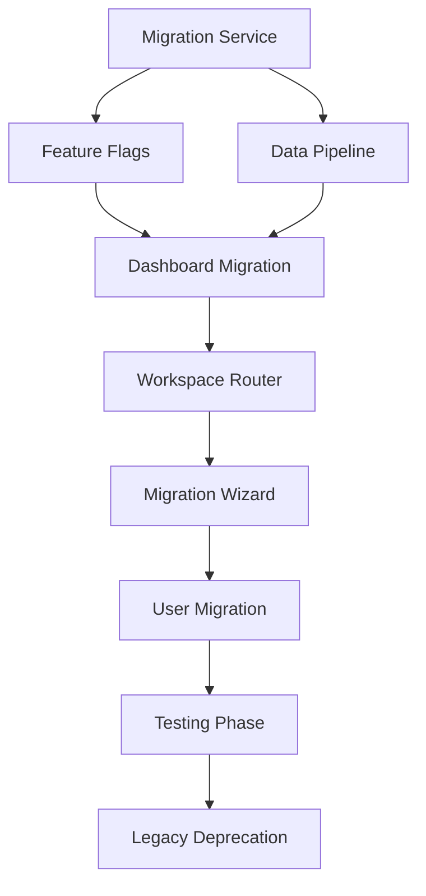

# Migration Task Breakdown & Effort Estimates

## Phase 1: Foundation & Compatibility Layer (Weeks 1-2)

### 1.1 Migration Service Development
**Priority**: Critical | **Effort**: 40 hours | **Owner**: Lead Architect + Backend Dev

#### Tasks:
- [ ] **Data Transformation Utilities** (16h)
  - Create `ProjectToBlueprint` transformer
  - Create `BlueprintToProject` transformer  
  - Add validation for data integrity
  - Handle edge cases and malformed data

- [ ] **Bidirectional Sync Service** (12h)
  - Real-time synchronization between collections
  - Conflict resolution strategies
  - Event-driven updates using Firebase triggers

- [ ] **Migration Pipeline** (12h)
  - Batch migration utilities for existing projects
  - Progress tracking and resumption capability
  - Error handling and recovery mechanisms

**Files to Create**:
- `src/services/MigrationService.ts`
- `src/utils/DataTransforms.ts`
- `src/utils/SyncService.ts`

### 1.2 Feature Flag System
**Priority**: Critical | **Effort**: 16 hours | **Owner**: Frontend Dev

#### Tasks:
- [ ] **Feature Flag Framework** (8h)
  - User-level feature flag storage
  - Context provider for feature flag access
  - Admin interface for flag management

- [ ] **A/B Testing Infrastructure** (8h)
  - User segmentation logic
  - Experiment tracking and analytics
  - Gradual rollout mechanisms

**Files to Create**:
- `src/utils/FeatureFlags.ts`
- `src/context/FeatureFlagContext.tsx`
- `src/components/FeatureFlagProvider.tsx`

### 1.3 Routing Strategy
**Priority**: High | **Effort**: 20 hours | **Owner**: Frontend Dev

#### Tasks:
- [ ] **Architecture Detection Middleware** (8h)
  - Detect user's current architecture preference
  - Route to appropriate components based on data
  - Handle URL parameter preservation

- [ ] **Seamless Navigation** (8h)
  - Redirect logic between architectures
  - Bookmark and deep-link preservation
  - History management for back/forward navigation

- [ ] **Fallback Mechanisms** (4h)
  - Automatic fallback to legacy on errors
  - User notification of architecture switches
  - Error boundary integration

**Files to Create**:
- `src/middleware/ArchitectureRouter.tsx`
- `src/utils/NavigationHelper.ts`

## Phase 2: Dashboard Migration (Weeks 3-4)

### 2.1 Unified Dashboard Component
**Priority**: High | **Effort**: 32 hours | **Owner**: Frontend Dev

#### Tasks:
- [ ] **Dashboard Architecture Detection** (8h)
  - Determine user's optimal architecture
  - Display mixed project types
  - Handle architecture switching UI

- [ ] **Data Aggregation Service** (12h)
  - Fetch from both `projects` and `blueprints`
  - Merge and sort by relevance/date
  - Cache for performance optimization

- [ ] **Migration Prompts & Education** (8h)
  - In-context migration suggestions
  - Feature comparison tooltips
  - User onboarding for new architecture

- [ ] **Performance Optimization** (4h)
  - Lazy loading for large project lists
  - Virtual scrolling for performance
  - Optimistic updates for user actions

**Files to Create**:
- `src/components/UnifiedDashboard.tsx`
- `src/services/ProjectAggregationService.ts`
- `src/components/MigrationPrompt.tsx`

### 2.2 Enhanced ProjectCard
**Priority**: Medium | **Effort**: 20 hours | **Owner**: Frontend Dev

#### Tasks:
- [ ] **Multi-Format Support** (8h)
  - Handle both legacy and new data formats
  - Unified display interface
  - Data normalization utilities

- [ ] **Visual Architecture Indicators** (6h)
  - Architecture version badges
  - Progress indicators for both formats
  - Migration status displays

- [ ] **Interactive Migration** (6h)
  - One-click migration initiation
  - Progress tracking within card
  - Error handling and rollback

**Files to Modify**:
- `src/components/ProjectCard.jsx` → `src/components/ProjectCard.tsx`

### 2.3 New Project Creation Flow
**Priority**: Medium | **Effort**: 16 hours | **Owner**: Frontend Dev

#### Tasks:
- [ ] **Intelligent Routing** (8h)
  - Route new projects to new architecture by default
  - Feature flag integration for beta users
  - Legacy fallback for specific use cases

- [ ] **Wizard Enhancement** (8h)
  - Improve WizardWrapper for better UX
  - Add preview of new features
  - Streamline onboarding process

**Files to Modify**:
- `src/features/wizard/WizardWrapper.tsx`

## Phase 3: Workspace Migration (Weeks 5-7)

### 3.1 Workspace Router Development
**Priority**: Critical | **Effort**: 36 hours | **Owner**: Lead Architect + Frontend Dev

#### Tasks:
- [ ] **Intelligent Workspace Routing** (16h)
  - Detect project type and route appropriately
  - Handle URL parameters and state preservation
  - Error boundaries for routing failures

- [ ] **Legacy Workspace Maintenance** (8h)
  - Ensure MainWorkspace.jsx continues functioning
  - Add migration prompts within legacy interface
  - Deprecation warnings for old features

- [ ] **New Workspace Integration** (12h)
  - Integrate ChatInterface into main router
  - Handle authentication and permissions
  - State management between architectures

**Files to Create**:
- `src/components/WorkspaceRouter.tsx`
- `src/components/LegacyWorkspaceWrapper.tsx`

### 3.2 In-App Migration Wizard
**Priority**: High | **Effort**: 40 hours | **Owner**: Frontend Dev + Backend Dev

#### Tasks:
- [ ] **Migration Wizard UI** (20h)
  - Step-by-step migration process
  - Progress tracking and status updates
  - Data preview and validation interface

- [ ] **Data Migration Logic** (16h)
  - Project validation before migration
  - Incremental migration with checkpoints
  - Rollback capabilities if issues arise

- [ ] **User Communication** (4h)
  - Clear explanations of migration benefits
  - Feature comparison and education
  - Success and error messaging

**Files to Create**:
- `src/components/MigrationWizard.tsx`
- `src/services/InAppMigrationService.ts`

### 3.3 Progressive Enhancement Features
**Priority**: Medium | **Effort**: 24 hours | **Owner**: Frontend Dev

#### Tasks:
- [ ] **Feature Discovery** (8h)
  - Highlight new capabilities in context
  - Interactive tooltips and guided tours
  - Feature adoption tracking

- [ ] **Side-by-Side Comparison** (8h)
  - Show old vs new side-by-side
  - Interactive feature comparison
  - User preference collection

- [ ] **Export/Import Tools** (8h)
  - Export projects from legacy format
  - Import into new architecture
  - Validation and error handling

**Files to Create**:
- `src/components/FeatureDiscovery.tsx`
- `src/components/ArchitectureComparison.tsx`
- `src/utils/ExportImportService.ts`

## Phase 4: User Migration & Testing (Weeks 8-10)

### 4.1 Phased User Migration System
**Priority**: Critical | **Effort**: 32 hours | **Owner**: Lead Architect + Backend Dev

#### Tasks:
- [ ] **User Segmentation Logic** (12h)
  - Identify user types (power users, casual users, etc.)
  - Create migration cohorts and schedules
  - Feature flag management for segments

- [ ] **Migration Analytics** (12h)
  - Track migration success rates
  - Monitor user behavior changes
  - Error tracking and resolution

- [ ] **Communication System** (8h)
  - Automated email campaigns for each phase
  - In-app notifications and announcements
  - Support escalation procedures

**Files to Create**:
- `src/services/UserSegmentationService.ts`
- `src/analytics/MigrationAnalytics.ts`
- `src/services/NotificationService.ts`

### 4.2 Comprehensive Testing Suite
**Priority**: High | **Effort**: 48 hours | **Owner**: QA Engineer + Frontend Dev

#### Tasks:
- [ ] **Automated Testing** (24h)
  - Unit tests for all new components (95% coverage)
  - Integration tests for migration workflows
  - End-to-end testing for user journeys

- [ ] **Performance Testing** (16h)
  - Load testing with simulated user base
  - Database performance optimization
  - CDN and caching strategy validation

- [ ] **User Acceptance Testing** (8h)
  - Beta user feedback collection
  - Usability testing sessions
  - Accessibility compliance testing

**Files to Create**:
- `tests/migration/` directory with comprehensive test suite
- `tests/performance/` directory with load tests
- `docs/testing-strategy.md`

### 4.3 Support Infrastructure
**Priority**: Medium | **Effort**: 20 hours | **Owner**: Frontend Dev

#### Tasks:
- [ ] **Enhanced Documentation** (12h)
  - Migration guide for users
  - Feature comparison documentation
  - Troubleshooting guides

- [ ] **User Training Materials** (8h)
  - Video tutorials for new features
  - Interactive onboarding flows
  - FAQ and knowledge base

**Files to Create**:
- `docs/user-migration-guide.md`
- `src/components/InteractiveOnboarding.tsx`

## Phase 5: Legacy Deprecation (Weeks 11-12)

### 5.1 Legacy System Sunset
**Priority**: High | **Effort**: 24 hours | **Owner**: Lead Architect

#### Tasks:
- [ ] **Traffic Redirection** (8h)
  - Update all routes to new architecture
  - Maintain read-only access to legacy data
  - Handle edge cases and fallbacks

- [ ] **Code Cleanup** (12h)
  - Remove unused legacy components
  - Clean up deprecated API endpoints
  - Update dependencies and remove dead code

- [ ] **Database Optimization** (4h)
  - Archive old project data
  - Optimize indices for new schema
  - Clean up unused collections and fields

**Files to Remove**:
- `src/components/MainWorkspace.jsx`
- `src/context/AppContext.jsx` (legacy parts)
- Legacy chat and wizard components

### 5.2 Performance Optimization
**Priority**: Medium | **Effort**: 16 hours | **Owner**: Backend Dev

#### Tasks:
- [ ] **Bundle Optimization** (8h)
  - Remove legacy code from bundles
  - Tree-shaking and code splitting
  - Asset optimization and compression

- [ ] **Database Performance** (8h)
  - Index optimization for blueprints collection
  - Query optimization for common operations
  - Caching strategy implementation

### 5.3 Documentation & Handoff
**Priority**: Medium | **Effort**: 16 hours | **Owner**: Lead Architect

#### Tasks:
- [ ] **Technical Documentation** (8h)
  - Architecture decision records
  - API documentation updates
  - Deployment and maintenance guides

- [ ] **Team Training** (8h)
  - Knowledge transfer sessions
  - Code review processes for new architecture
  - Monitoring and alerting setup

## Critical Path Dependencies

## Resource Allocation Summary

### By Role:
- **Lead Architect**: 120 hours (3 weeks full-time)
- **Frontend Developers**: 320 hours (4 weeks full-time each for 2 devs)
- **Backend Developer**: 80 hours (2 weeks full-time)
- **QA Engineer**: 48 hours (1.2 weeks full-time)

### By Phase:
- **Phase 1**: 76 hours (1.9 weeks)
- **Phase 2**: 68 hours (1.7 weeks)  
- **Phase 3**: 100 hours (2.5 weeks)
- **Phase 4**: 100 hours (2.5 weeks)
- **Phase 5**: 56 hours (1.4 weeks)

**Total Effort**: 400 hours across 12 weeks

### Risk Buffers:
- **High-Risk Tasks**: +25% buffer
- **Medium-Risk Tasks**: +15% buffer
- **Low-Risk Tasks**: +10% buffer

**Total with Risk Buffer**: 460 hours (11.5 weeks with optimal team)

## Success Criteria Checklist

### Phase 1 Completion:
- [ ] Migration service passes all data integrity tests
- [ ] Feature flags control user experience successfully
- [ ] Routing works seamlessly between architectures

### Phase 2 Completion:
- [ ] Dashboard displays both project types correctly
- [ ] New project creation uses new architecture by default
- [ ] Migration prompts guide users effectively

### Phase 3 Completion:
- [ ] Workspace routing works for all project types
- [ ] In-app migration has >95% success rate
- [ ] User feedback on new features is positive

### Phase 4 Completion:
- [ ] >90% of active users migrated successfully
- [ ] System performance meets all targets
- [ ] Support ticket volume remains manageable

### Phase 5 Completion:
- [ ] Legacy system fully deprecated
- [ ] Performance improvements achieved
- [ ] Team fully trained on new architecture

This detailed breakdown provides clear accountability, realistic timelines, and measurable outcomes for the migration project.