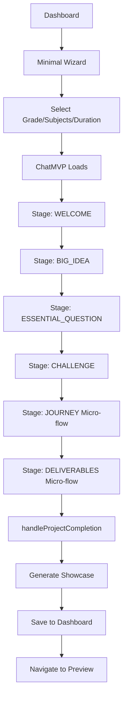

# ALF Project Builder (ChatMVP) - Complete Technical Guide

**Last Updated:** 2025-10-06
**Version:** 2.0
**Purpose:** Comprehensive technical documentation for ALF's conversational project builder

---

## Table of Contents

1. [Overview](#overview)
2. [Architecture & Core Concepts](#architecture--core-concepts)
3. [Complete User Flow](#complete-user-flow)
4. [Stage-by-Stage Breakdown](#stage-by-stage-breakdown)
5. [Data Flow & Storage](#data-flow--storage)
6. [Key Files Reference](#key-files-reference)
7. [AI Generation Systems](#ai-generation-systems)
8. [Project Completion & Showcase](#project-completion--showcase)
9. [Common Debugging Scenarios](#common-debugging-scenarios)
10. [Extension Points](#extension-points)

---

## Overview

### What is ALF Project Builder?

ALF Project Builder (ChatMVP) is a conversational AI system that guides educators through creating complete project-based learning (PBL) units via natural language chat. It replaces complex forms with an intelligent conversation that captures project ideas, structures learning journeys, and generates professional teaching materials.

### Key Features

- **Conversational Interface**: Natural language chat instead of forms
- **Staged Progression**: 5 stages (Big Idea → Essential Question → Challenge → Learning Journey → Deliverables)
- **Intelligent Micro-flows**: Specialized sub-flows for complex stages (Journey, Deliverables)
- **AI-Powered Generation**: Automatic creation of assignments, lesson plans, and materials
- **Professional Output**: Complete showcase projects matching sample project quality
- **Progressive Capture**: Data saved and validated at each stage

### Success Criteria

When complete, educators have:
- Professional course description and tagline
- 3-5 detailed assignments with student/teacher directions
- Week-by-week lesson plans with checkpoints
- Complete materials list and assessment rubric
- Ready-to-implement project structure

---

## Architecture & Core Concepts

### 1. Stage-Based Progression

The system uses a linear stage model:

```
WELCOME → BIG_IDEA → ESSENTIAL_QUESTION → CHALLENGE → JOURNEY → DELIVERABLES → COMPLETED
```

Each stage:
- Has validation requirements (gating)
- Captures specific data
- Provides contextual guidance
- Offers suggestion chips
- Must be "complete" before advancing

### 2. Captured Data Structure

All user input accumulates in a single `CapturedData` object:

```typescript
interface CapturedData {
  ideation: {
    bigIdea?: string;           // The core concept/theme
    essentialQuestion?: string;  // The driving question
    challenge?: string;          // The authentic challenge
  };
  journey: {
    phases: Array<{
      name: string;              // Phase name
      activities: string[];      // Activities in this phase
    }>;
    resources?: string[];        // Optional resources
  };
  deliverables: {
    milestones: Array<{
      name: string;              // Progress checkpoints
    }>;
    artifacts: Array<{
      name: string;              // Student-created products
    }>;
    rubric: {
      criteria: string[];        // Assessment criteria
    };
  };
}
```

### 3. Wizard Context

Metadata captured during initial wizard (grade level, subjects, duration):

```typescript
interface WizardContext {
  gradeLevel?: string;    // e.g., "Middle School (6-8)"
  subjects?: string[];    // e.g., ["Science", "ELA"]
  duration?: string;      // e.g., "8-10 weeks"
  projectTopic?: string;  // Optional topic hint
}
```

### 4. Micro-Flow States

Complex stages (Journey, Deliverables) use micro-flow state machines:

```typescript
interface JourneyMicroState {
  suggestedPhases: Phase[];     // AI-generated phases
  workingPhases: Phase[];       // User-edited phases
  focusIndex?: number;          // Which phase is being refined
  mode: 'suggesting' | 'refining' | 'accepting';
}

interface DeliverablesMicroState {
  suggestedMilestones: string[];
  suggestedArtifacts: string[];
  suggestedCriteria: string[];
  mode: 'suggesting' | 'refining' | 'accepting';
}
```

---

## Complete User Flow

### Entry Points

1. **Dashboard** → "Start New Project" → Minimal Wizard
2. **Minimal Wizard** → Select project type → ChatMVP

### Full Journey



### Timeline

1. **0min**: User clicks "Start New Project"
2. **1min**: Completes minimal wizard (3 inputs)
3. **2-15min**: Conversational chat through 5 stages
4. **15-20min**: AI generates complete showcase (30-60 seconds)
5. **20min+**: Professional project ready on dashboard

---

## Stage-by-Stage Breakdown

### Stage 1: WELCOME

**Purpose**: Orient user and set expectations

**What Happens:**
- Display welcome message with stage overview
- Show suggestion chips for getting started
- No data capture required
- Auto-advances after first user message

**Key Files:**
- `ChatMVP.tsx` (lines 1350-1400)
- `stages.ts` (`stageGuide`, `stageSuggestions`)

**Validation:**
- None (always passes)

---

### Stage 2: BIG_IDEA

**Purpose**: Capture the core concept students will explore

**What Happens:**
- AI prompts: "What's the central concept you want students to grasp?"
- User types big idea (e.g., "Diverse communities reshape city infrastructure")
- System captures input
- Validates: Minimum 10 characters
- Shows coaching feedback
- Auto-advances if validation passes

**Data Captured:**
```typescript
captured.ideation.bigIdea = userInput;
```

**Validation Requirements:**
```typescript
if (!bigIdea || bigIdea.length < 10) {
  return { ok: false, reason: 'Big idea needs more detail' };
}
```

**Key Files:**
- `stages.ts` (`captureStageInput`, `validate`)
- `ChatMVP.tsx` (`handleSend`)

**User Experience:**
- Types naturally in chat
- Gets immediate feedback
- Sees progress in sidebar
- Can refine before moving on

---

### Stage 3: ESSENTIAL_QUESTION

**Purpose**: Frame the inquiry with a driving question

**What Happens:**
- AI prompts: "What essential question will guide student investigation?"
- User types question (e.g., "How do immigrants challenge and change city planning?")
- System suggests question format if needed
- Validates: Starts with question word, minimum 15 characters
- Auto-advances if validation passes

**Data Captured:**
```typescript
captured.ideation.essentialQuestion = userInput;
```

**Validation Requirements:**
```typescript
if (!essentialQuestion || essentialQuestion.length < 15) {
  return { ok: false, reason: 'Essential question needs more detail' };
}
```

**AI Assistance:**
- Suggests question stems ("How might...", "What if...", "Why do...")
- Refines questions to be open-ended
- Checks for authentic inquiry

---

### Stage 4: CHALLENGE

**Purpose**: Define the authentic task students will complete

**What Happens:**
- AI prompts: "What will students create or do to address this question?"
- User describes challenge (e.g., "Design action plan for school leaders")
- System extracts audience and deliverable
- Validates: Minimum 15 characters, mentions audience or action
- Auto-advances if validation passes

**Data Captured:**
```typescript
captured.ideation.challenge = userInput;
```

**Validation Requirements:**
```typescript
if (!challenge || challenge.length < 15) {
  return { ok: false, reason: 'Challenge needs more detail' };
}
```

**AI Assistance:**
- Suggests authentic audiences (school leaders, community partners)
- Refines for clarity and actionability
- Checks for real-world connection

---

### Stage 5: JOURNEY (Micro-flow)

**Purpose**: Structure the learning progression into phases

**What Happens:**

1. **AI Generation Phase**:
   - System calls `initJourneyMicroFlow()`
   - AI generates 3-5 phases based on Big Idea, Challenge, Grade Level
   - Each phase has: name, activities (2-3 per phase)
   - State: `mode: 'suggesting'`

2. **Presentation Phase**:
   - Shows phases in `JourneyPreviewCard` component
   - User can rename phases (inline editing)
   - User can reorder phases (drag handles)
   - Action chips: "Yes, use all", "Refine phase X", "Regenerate"

3. **Decision Phase**:
   - User accepts all → Captures phases, advances to DELIVERABLES
   - User refines → AI regenerates specific phase
   - User regenerates → AI creates completely new phases

**Data Captured:**
```typescript
captured.journey.phases = [
  { name: "Phase 1", activities: ["Activity A", "Activity B"] },
  { name: "Phase 2", activities: ["Activity C", "Activity D"] },
  // ...
];
```

**Validation Requirements:**
```typescript
if (!journey?.phases || journey.phases.length < 3) {
  return { ok: false, reason: 'Need at least 3 phases' };
}
```

**Key Files:**
- `journeyMicroFlow.ts` (entire file)
- `JourneyPreviewCard.tsx` (UI component)
- `ChatMVP.tsx` (`processJourneyResult`)

**State Management:**
```typescript
const [journeyMicroState, setJourneyMicroState] = useState<JourneyMicroState | null>(null);
```

**Action Flow:**
```
User clicks "Yes, use all of these"
  ↓
handleJourneyChoice(state, 'accept_all')
  ↓
Returns: { action: 'accept_all', finalPhases: [...] }
  ↓
processJourneyResult()
  ↓
captureStageInput(captured, 'JOURNEY', JSON.stringify(phases))
  ↓
validate('JOURNEY', updatedCaptured)
  ↓
If valid: nextStage('JOURNEY') → 'DELIVERABLES'
  ↓
setStage('DELIVERABLES')
  ↓
initDeliverablesMicroFlow()
```

**Critical Bug Fix:**
- `captureStageInput` now handles JSON-stringified phases
- Parses JSON first, falls back to text extraction
- Fixed at `stages.ts:670-691`

---

### Stage 6: DELIVERABLES (Micro-flow)

**Purpose**: Define milestones, artifacts, and rubric

**What Happens:**

1. **AI Generation Phase**:
   - System calls `initDeliverablesMicroFlow()`
   - AI generates:
     - 3-5 milestones (progress checkpoints)
     - 2-4 artifacts (student-created products)
     - 3-6 rubric criteria (assessment standards)
   - State: `mode: 'suggesting'`

2. **Presentation Phase**:
   - Shows three columns: Milestones, Artifacts, Criteria
   - Each item can be renamed inline
   - Action chips: "Yes, use all", "Customize", "Regenerate"

3. **Decision Phase**:
   - User accepts all → Captures deliverables, triggers completion
   - User customizes → Shows expanded editing interface
   - User regenerates → AI creates new suggestions

**Data Captured:**
```typescript
captured.deliverables = {
  milestones: [
    { name: "Checkpoint 1" },
    { name: "Checkpoint 2" },
    // ...
  ],
  artifacts: [
    { name: "Evidence-based proposal" },
    { name: "Implementation timeline" },
    // ...
  ],
  rubric: {
    criteria: [
      "Scientific evidence is credible and relevant",
      "Methodology is sound and well-documented",
      // ...
    ]
  }
};
```

**Validation Requirements:**
```typescript
if (!deliverables?.milestones || deliverables.milestones.length < 3) {
  return { ok: false, reason: 'Need at least 3 milestones' };
}
if (!deliverables?.artifacts || deliverables.artifacts.length < 1) {
  return { ok: false, reason: 'Need at least 1 artifact' };
}
if (!deliverables?.rubric?.criteria || deliverables.rubric.criteria.length < 3) {
  return { ok: false, reason: 'Need at least 3 rubric criteria' };
}
```

**Key Files:**
- `deliverablesMicroFlow.ts` (entire file)
- `DeliverablesPreviewCard.tsx` (UI component)
- `ChatMVP.tsx` (`processDeliverablesResult`)

**Completion Trigger:**
```typescript
const previousStatus = computeStatus(captured);
const newStatus = computeStatus(updatedCaptured);
if (previousStatus !== 'ready' && newStatus === 'ready') {
  setMode('validating');
  setFocus('overview');
  await handleProjectCompletion();
}
```

**Critical**: When deliverables validation passes, `handleProjectCompletion()` is automatically called.

---

### Stage 7: COMPLETED (Auto-triggered)

**Purpose**: Generate complete showcase and save project

**What Happens:**

1. **Notification**:
   - Shows "Finalizing your project..." message

2. **Parallel AI Generation**:
   ```typescript
   const [description, tagline, showcase] = await Promise.all([
     generateCourseDescription(captured, wizard),
     generateTagline(captured, wizard),
     generateProjectShowcase(captured, wizard, metadata)
   ]);
   ```

3. **Quality Verification**:
   - Checks description word count (120-180 target)
   - Detects template fallback patterns
   - Validates all showcase components

4. **Preview Display**:
   - Shows title, tagline, description
   - Shows generated counts (assignments, weeks)
   - Shows quality check results

5. **Project Assembly**:
   ```typescript
   const completeProject = {
     id, title, description, tagline,
     showcase: { /* complete structure */ },
     capturedData: { ideation, journey, deliverables },
     status: 'ready',
     stage: 'COMPLETED',
     completedAt: new Date()
   };
   ```

6. **Save & Transform**:
   - Save to `unifiedStorage`
   - Trigger hero transformation for ReviewScreen
   - Log all metrics

7. **Completion Message**:
   - Shows what was generated
   - Provides next steps (Review Project, Dashboard)

**Key Files:**
- `ChatMVP.tsx` (`handleProjectCompletion`, lines 546-700)
- `courseDescriptionGenerator.ts` (description + tagline)
- `projectShowcaseGenerator.ts` (complete showcase)

---

## Data Flow & Storage

### 1. Chat Engine

**Component**: `useChatEngine` hook

**Manages**:
- Message history
- Input state
- Message rendering
- Scroll behavior

**Key Methods**:
- `appendMessage(msg)`: Add assistant or user message
- `setInput(text)`: Update input field
- `messages`: Array of all chat messages

---

### 2. Captured Data Management

**State Hook**:
```typescript
const [captured, setCaptured] = useState<CapturedData>(createEmptyCaptured());
```

**Update Flow**:
```
User sends message
  ↓
handleSend()
  ↓
captureStageInput(captured, stage, input)
  ↓
Returns: updatedCaptured
  ↓
setCaptured(updatedCaptured)
  ↓
validate(stage, updatedCaptured)
  ↓
If valid: advance to next stage
```

**Autosave**:
```typescript
useEffect(() => {
  if (autosaveEnabled && projectId) {
    const serialized = serializeCaptured(captured);
    await unifiedStorage.saveProject({
      id: projectId,
      capturedData: captured,
      stage: currentStage,
      updatedAt: new Date()
    });
  }
}, [captured, stage]);
```

---

### 3. Project Storage (UnifiedStorageManager)

**Location**: `localStorage` (primary), Firebase (backup sync)

**Keys**:
- `alf_project_{projectId}`: Individual project data
- `alf_project_index`: List of all project IDs
- `alf_project_backup_{timestamp}`: Rotating backups (5 max)

**Methods**:
- `saveProject(project)`: Save/update project
- `loadProject(projectId)`: Load project data
- `list(userId)`: Get all projects for user
- `delete(userId, projectId)`: Soft delete
- `updateProjectTitle(projectId, newTitle)`: Edit title

**Data Structure**:
```typescript
{
  id: string,
  title: string,
  description: string,
  tagline: string,

  showcase: ProjectShowcaseV2, // Complete structure

  capturedData: CapturedData,
  wizardData: WizardContext,

  status: 'draft' | 'ready',
  stage: Stage,
  source: 'chat',

  createdAt: Date,
  updatedAt: Date,
  completedAt?: Date
}
```

---

### 4. Hero Transformation

**Purpose**: Convert raw project data into showcase-ready format

**Trigger**: After project completion

**Process**:
```typescript
await unifiedStorage.loadHeroProject(projectId);
  ↓
Checks for cached hero data
  ↓
If not cached: transforms project using HeroProjectTransformer
  ↓
Saves transformed data to: alf_hero_{projectId}
  ↓
Returns: EnhancedHeroProjectData
```

**Used By**: ReviewScreen to display professional showcase

---

## Key Files Reference

### Core Chat System

#### `ChatMVP.tsx` (1700+ lines)
**Location**: `/src/features/chat-mvp/ChatMVP.tsx`

**Purpose**: Main orchestrator for entire chat experience

**Key Responsibilities**:
- Stage management and progression
- Message handling and AI generation
- Micro-flow coordination
- Project completion
- Autosave
- UI rendering

**Critical Sections**:
- Lines 546-700: `handleProjectCompletion()`
- Lines 699-847: `processJourneyResult()`
- Lines 849-941: `processDeliverablesResult()`
- Lines 1100-1300: `handleSend()` - Main message handler
- Lines 1350-1700: JSX rendering

**State Management**:
```typescript
const [stage, setStage] = useState<Stage>('WELCOME');
const [captured, setCaptured] = useState<CapturedData>(createEmptyCaptured());
const [journeyMicroState, setJourneyMicroState] = useState<JourneyMicroState | null>(null);
const [deliverablesMicroState, setDeliverablesMicroState] = useState<DeliverablesMicroState | null>(null);
```

**Dependencies**:
- useChatEngine (message management)
- useResponsiveLayout (UI responsiveness)
- unifiedStorage (data persistence)
- All domain files (stages, AI generation, micro-flows)

---

#### `stages.ts` (1000+ lines)
**Location**: `/src/features/chat-mvp/domain/stages.ts`

**Purpose**: Stage definitions, validation, data capture logic

**Key Exports**:

```typescript
// Types
type Stage = 'WELCOME' | 'BIG_IDEA' | 'ESSENTIAL_QUESTION' | 'CHALLENGE' | 'JOURNEY' | 'DELIVERABLES' | 'COMPLETED';
interface CapturedData { /* ... */ }
interface WizardContext { /* ... */ }

// Stage metadata
const stageOrder: Stage[]; // Progression sequence
const stageDisplayNames: Record<Stage, string>; // UI labels
const stageGuide: Record<Stage, StageGuidance>; // Contextual help
const stageSuggestions: Record<Stage, string[]>; // Suggestion chips

// Core functions
function validate(stage: Stage, captured: CapturedData): GatingInfo;
function captureStageInput(captured: CapturedData, stage: Stage, input: string): CapturedData;
function nextStage(currentStage: Stage): Stage | null;
function computeStatus(captured: CapturedData): 'empty' | 'partial' | 'ready';
function transitionMessageFor(fromStage: Stage, captured: CapturedData, wizard: WizardContext): string;
```

**Critical Functions**:

1. **`validate(stage, captured)`** (lines 280-400)
   - Checks if stage requirements met
   - Returns `{ ok: boolean, reason?: string }`
   - Used to gate stage advancement

2. **`captureStageInput(captured, stage, input)`** (lines 597-740)
   - Extracts data from user input
   - Updates captured object
   - Handles JSON for micro-flows
   - Returns new CapturedData (immutable)

3. **`nextStage(stage)`** (lines 250-270)
   - Returns next stage in sequence
   - Used for auto-advancement

**Bug Fix Zone**:
- Lines 670-691: JOURNEY JSON parsing (CRITICAL - handles micro-flow accept)
- Lines 729-740: DELIVERABLES JSON parsing

---

### AI Generation

#### `courseDescriptionGenerator.ts` (260+ lines)
**Location**: `/src/features/chat-mvp/domain/courseDescriptionGenerator.ts`

**Purpose**: Generate professional course descriptions and taglines

**Key Functions**:

1. **`generateCourseDescription(captured, wizard)`**
   - Target: 120-180 words
   - Model: Gemini 2.5 Flash Lite
   - Temperature: 0.6
   - Returns: Professional third-person description

2. **`generateTagline(captured, wizard)`**
   - Target: 8-12 words
   - Action-oriented and specific
   - Returns: Punchy project summary

3. **`verifyDescriptionQuality(description)`**
   - Checks word count
   - Detects template fallback patterns
   - Checks for buzzwords
   - Validates third-person POV
   - Returns: `{ isValid, warnings, wordCount, isLikelyTemplate }`

**Prompt Structure**:
```typescript
const prompt = [
  'Generate a concise, professional course description (120-180 words)...',
  '**Project Details:**',
  `- Big Idea: ${bigIdea}`,
  `- Challenge: ${challenge}`,
  // ...
  '**Requirements:**',
  '1. Write in third person',
  '2. Start with what students explore',
  // ...
].join('\n');
```

**Fallbacks**: Every function has template-based fallback if AI fails

---

#### `projectShowcaseGenerator.ts` (700+ lines) - NEW
**Location**: `/src/features/chat-mvp/domain/projectShowcaseGenerator.ts`

**Purpose**: Generate complete ProjectShowcaseV2 structure with assignments and lesson plans

**Main Function**:
```typescript
async function generateProjectShowcase(
  captured: CapturedData,
  wizard: WizardContext,
  metadata: { projectId, title, tagline, description }
): Promise<ProjectShowcaseV2>
```

**What It Generates**:

1. **Micro-Overview** (3 sentences)
   - Uses `generateMicroOverview()`
   - AI prompt targeting 12-28 words per sentence
   - Describes investigation, building, and sharing

2. **Run-of-Show** (Week cards)
   - Uses `generateRunOfShow()` → `generateWeekCard()`
   - 1 week per phase
   - Each card has:
     - Focus statement (under 90 chars)
     - Teacher actions (3-5 bullets)
     - Student actions (3-5 bullets)
     - Deliverables (2-3)
     - Checkpoints (1-2)

3. **Assignments** (Detailed cards)
   - Uses `generateAssignments()` → `generateAssignment()`
   - 1 assignment per phase (up to 6)
   - Each has:
     - Title, summary
     - Student directions (5-7 steps)
     - Teacher setup (3-5 items)
     - Evidence of learning
     - Success criteria ("I can..." statements)
     - Checkpoint

4. **Outcomes**
   - Uses `generateOutcomes()`
   - Core outcomes (3)
   - Extras (4-6)
   - Audiences (3-5)

5. **Materials**
   - Uses `generateMaterials()`
   - Core kit (5 items)
   - No-tech fallback (3 items)

**AI Model**: Gemini 2.5 Flash Lite (all generators)

**JSON Parsing**: All AI outputs parsed as JSON with fallbacks

---

### Micro-Flow Systems

#### `journeyMicroFlow.ts` (500+ lines)
**Location**: `/src/features/chat-mvp/domain/journeyMicroFlow.ts`

**Purpose**: Manage Journey phase generation and refinement

**Key Functions**:

1. **`initJourneyMicroFlow(captured, wizard)`**
   - Generates initial 3-5 phases
   - Returns: `JourneyMicroState`

2. **`handleJourneyChoice(state, userInput)`**
   - Parses user intent ("accept_all", "refine", "regenerate")
   - Returns: `JourneyChoiceResult { action, finalPhases?, updatedState? }`

3. **`formatJourneySuggestion(state)`**
   - Formats phases for display
   - Returns: Markdown string with phase cards

4. **`getJourneyActionChips(state)`**
   - Returns: Array of action button labels

**State Machine**:
```
suggesting → refining → accepting
     ↓          ↓           ↓
  Initial   Edit phase  Finalize
```

**AI Generation**:
```typescript
const prompt = buildJourneyPhasesPrompt(bigIdea, challenge, gradeLevel);
const result = await generateAI(prompt, {
  model: 'gemini-2.5-flash-lite',
  temperature: 0.7
});
const phases = parseJourneyResponse(result);
```

---

#### `deliverablesMicroFlow.ts` (500+ lines)
**Location**: `/src/features/chat-mvp/domain/deliverablesMicroFlow.ts`

**Purpose**: Manage Deliverables generation and refinement

**Key Functions**:

1. **`initDeliverablesMicroFlow(captured, wizard)`**
   - Generates milestones, artifacts, criteria
   - Returns: `DeliverablesMicroState`

2. **`handleDeliverablesChoice(state, userInput)`**
   - Parses user intent
   - Returns: `DeliverablesChoiceResult { action, captured?, newState? }`

3. **`formatDeliverablesSuggestion(state)`**
   - Formats three-column layout
   - Returns: Markdown string

4. **`getDeliverablesActionChips(state)`**
   - Returns: Action button labels

**AI Generation**:
```typescript
const prompt = buildDeliverablesPrompt(challenge, phases, artifacts);
const result = await generateAI(prompt, {
  model: 'gemini-2.5-flash-lite',
  temperature: 0.6
});
const { milestones, artifacts, criteria } = parseDeliverablesResponse(result);
```

---

### UI Components

#### `WorkingDraftSidebar.tsx` (230 lines)
**Location**: `/src/features/chat-mvp/components/WorkingDraftSidebar.tsx`

**Purpose**: Show live progress of captured data

**Displays**:
- Big Idea (status: complete/partial/empty)
- Essential Question (status)
- Challenge (status)
- Learning Journey (X phases mapped)
- Deliverables (X milestones, Y artifacts)
- Progress bar (X of 5 complete)

**Interactivity**:
- Click completed items to edit/review
- Visual indicators (green checkmarks, amber circles)
- Color-coded borders (current stage highlighted)

**Key Feature**: `onEditStage(stage)` callback allows jumping back to earlier stages

---

#### `JourneyPreviewCard.tsx` (300+ lines)
**Location**: `/src/features/chat-mvp/components/JourneyPreviewCard.tsx`

**Purpose**: Display and edit journey phases

**Features**:
- Phase cards with inline editing
- Rename phases (click to edit)
- Reorder phases (drag handles)
- Expand/collapse activities
- Action buttons (Accept, Refine, Regenerate)

**Props**:
```typescript
interface JourneyPreviewCardProps {
  state: JourneyMicroState;
  onRename: (index: number, name: string) => void;
  onReorder: (from: number, to: number) => void;
  onQuickCommand: (command: string) => void;
}
```

---

#### `DeliverablesPreviewCard.tsx` (400+ lines)
**Location**: `/src/features/chat-mvp/components/DeliverablesPreviewCard.tsx`

**Purpose**: Display and edit deliverables

**Features**:
- Three-column layout (Milestones | Artifacts | Criteria)
- Inline editing for all items
- Visual counts and icons
- Action buttons (Accept, Customize, Regenerate)

**Props**:
```typescript
interface DeliverablesPreviewCardProps {
  state: DeliverablesMicroState;
  onRename: (section: 'milestones' | 'artifacts' | 'criteria', index: number, text: string) => void;
  onQuickCommand: (command: string) => void;
}
```

---

### Storage & Data

#### `UnifiedStorageManager.ts` (500+ lines)
**Location**: `/src/services/UnifiedStorageManager.ts`

**Purpose**: Unified interface for localStorage, Firebase, and backups

**Key Methods**:

```typescript
class UnifiedStorageManager {
  // Core CRUD
  async saveProject(project: UnifiedProjectData): Promise<string>;
  async loadProject(projectId: string): Promise<UnifiedProjectData | null>;
  async list(userId: string): Promise<ProjectSummary[]>;
  async delete(userId: string, projectId: string): Promise<void>;

  // Hero transformation
  async loadHeroProject(projectId: string): Promise<EnhancedHeroProjectData | null>;

  // Editing
  async updateProjectTitle(projectId: string, newTitle: string): Promise<void>;

  // Backup/restore
  async exportProject(projectId: string): Promise<string>;
  async importProject(jsonData: string): Promise<string>;

  // Maintenance
  async cleanupEmptyProjects(): Promise<number>;
  async purgeExpiredDeleted(): Promise<void>;
}
```

**Storage Strategy**:
1. Primary: localStorage (instant, no auth required)
2. Backup: Rotating 5 backups in localStorage
3. Sync: Firebase (background, optional)
4. Index: Fast project list without loading all data

**Data Keys**:
- `alf_project_{id}`: Project data
- `alf_project_index`: Project list
- `alf_hero_{id}`: Transformed showcase data
- `alf_project_backup_{timestamp}`: Backups

---

#### `ProjectRepository.ts`
**Location**: `/src/services/ProjectRepository.ts`

**Purpose**: Wrapper around UnifiedStorageManager for UI components

**Methods**:
```typescript
const projectRepository = {
  list: (userId) => unifiedStorage.list(userId),
  delete: (userId, projectId) => unifiedStorage.delete(userId, projectId),
  restore: (userId, projectId) => unifiedStorage.restore(userId, projectId),
  cleanupEmptyProjects: () => unifiedStorage.cleanupEmptyProjects()
};
```

---

### Routing & Navigation

#### `AuthenticatedApp.tsx`
**Location**: `/src/AuthenticatedApp.tsx`

**Key Routes**:

```typescript
<Route path="/app/dashboard" element={<Dashboard />} />
<Route path="/app/new" element={<IntakeWizardMinimal />} />
<Route path="/app/blueprint/:id" element={<ChatLoader />} />
<Route path="/app/project/:id/preview" element={<ReviewScreen />} /> // ← Showcase view
```

**ChatLoader**: Loads project data and renders ChatMVP with initial state

**Critical Fix**: `<AppLayout>` wrapper added to preview route (prevents navigation errors)

---

#### `Dashboard.jsx`
**Location**: `/src/components/Dashboard.jsx`

**Purpose**: Display all user projects

**Routing Logic**:
```typescript
const handleOpenDraft = (draftId) => {
  const project = drafts.find(d => d.id === draftId);

  if (project.status === 'ready' || project.stage === 'COMPLETED') {
    navigate(`/app/project/${draftId}/preview`); // ← Completed projects
  } else {
    navigate(`/app/blueprint/${draftId}`); // ← In-progress projects
  }
};
```

---

#### `ReviewScreen.tsx`
**Location**: `/src/features/review/ReviewScreen.tsx`

**Purpose**: Display completed project showcase

**Loading Process**:
```typescript
useEffect(() => {
  const loadHeroData = async () => {
    const enhanced = await unifiedStorage.loadHeroProject(id);
    if (enhanced) {
      setHeroData(enhanced);
    }
  };
  loadHeroData();
}, [id]);
```

**Display**: Full showcase with hero section, week-by-week plans, assignments, outcomes

---

## AI Generation Systems

### AI Provider Configuration

**Current Provider**: Google Gemini API

**Model**: `gemini-2.5-flash-lite`

**Why This Model**:
- Fast (< 1 second response)
- Cost-effective
- Good quality for structured outputs
- JSON mode support

**Configuration**:
```typescript
// ai.ts
const generateAI = async (prompt: string, options: {
  model?: string;
  temperature?: number;
  maxTokens?: number;
  systemPrompt?: string;
}) => {
  const model = options.model || 'gemini-2.5-flash-lite';
  const temperature = options.temperature || 0.7;
  const maxTokens = options.maxTokens || 500;

  // Call Gemini API
  const response = await geminiAPI.generateContent({
    prompt,
    systemPrompt: options.systemPrompt,
    temperature,
    maxOutputTokens: maxTokens
  });

  return response.text();
};
```

---

### Prompt Engineering Patterns

#### 1. Structured Output Prompts

For JSON responses:
```typescript
const prompt = `
Generate X for this project.

**Project Details:**
- Key: Value
- Key: Value

**Requirements:**
1. Requirement 1
2. Requirement 2

**Format as JSON:**
{
  "field1": "...",
  "field2": ["...", "..."]
}

Write ONLY valid JSON, no markdown:`;
```

#### 2. Constrained Generation

For specific word counts:
```typescript
const prompt = `
Generate a tagline (8-12 words) for this project.

**Examples:**
- "Students transform campus audit into community action plan." (8 words)
- "Learners investigate local history through oral storytelling." (8 words)

Write ONLY the tagline, nothing else:`;
```

#### 3. Few-Shot Examples

For consistency:
```typescript
const prompt = `
Generate micro-overview sentences (12-28 words each).

**Examples:**
- "Students audit campus waste, energy, and water systems to surface actionable sustainability gaps." (14 words)
- "Teams co-design solutions with facilities staff, modeling impact through data storytelling and budgets." (15 words)

Now generate for this project:`;
```

---

### Fallback Strategies

Every AI generation has a fallback:

```typescript
try {
  const aiResult = await generateAI(prompt, options);
  return parseResult(aiResult);
} catch (error) {
  console.error('[Generator] AI failed:', error);
  return generateFallback(inputs);
}
```

**Fallback Quality**:
- Template-based (uses captured data)
- Always valid (no AI parsing errors)
- Clearly logged (console warnings)
- User experience uninterrupted

---

## Project Completion & Showcase

### Completion Flow

```typescript
async function handleProjectCompletion() {
  // 1. Show progress
  engine.appendMessage('Finalizing your project...');

  // 2. Generate in parallel
  const [description, tagline, showcase] = await Promise.all([
    generateCourseDescription(captured, wizard),
    generateTagline(captured, wizard),
    generateProjectShowcase(captured, wizard, metadata)
  ]);

  // 3. Verify quality
  const quality = verifyDescriptionQuality(description);

  // 4. Show preview
  engine.appendMessage({
    content: `Project Preview\n\nTitle: ${title}\nTagline: ${tagline}\n...`
  });

  // 5. Build complete structure
  const completeProject = {
    id, title, description, tagline,
    showcase, // ← Complete showcase structure
    capturedData: { ideation, journey, deliverables },
    status: 'ready',
    completedAt: new Date()
  };

  // 6. Save
  await unifiedStorage.saveProject(completeProject);

  // 7. Transform for showcase
  await unifiedStorage.loadHeroProject(projectId);

  // 8. Show completion
  engine.appendMessage('Project Complete\n\nWhat\'s included:\n- X assignments\n...');
}
```

---

### Showcase Structure

**ProjectShowcaseV2 Interface**:

```typescript
interface ProjectShowcaseV2 {
  id: string;
  version: '2.0.0';

  hero: {
    title: string;
    tagline: string;
    gradeBand: 'ES' | 'MS' | 'HS';
    timeframe: '8-10 weeks' | etc;
    subjects: string[];
  };

  microOverview: string[]; // 3 sentences
  fullOverview: string; // Course description

  schedule: {
    totalWeeks: number;
    lessonsPerWeek: number;
    lessonLengthMin: 45 | 50 | 55 | 60;
  };

  runOfShow: WeekCard[]; // Week-by-week lesson plans

  assignments: AssignmentCard[]; // Detailed assignments

  outcomes: {
    core: string[]; // Essential outcomes
    extras: string[]; // Optional extensions
    audiences: string[]; // Who benefits
  };

  materialsPrep: {
    coreKit: string[]; // Required materials
    noTechFallback: string[]; // Low-tech alternatives
  };

  polish: {
    microRubric: string[]; // Assessment criteria
    checkpoints: string[]; // Progress checks
    tags: string[]; // Categorization
  };
}
```

**WeekCard Structure**:
```typescript
interface WeekCard {
  weekLabel: 'Week 1' | 'Weeks 3-4';
  kind: 'Foundations' | 'Planning' | 'Build' | 'Exhibit' | 'Extension';
  focus: string; // ≤ 90 chars
  teacher: string[]; // 3-5 bullets, ≤ 10 words
  students: string[]; // 3-5 bullets, ≤ 10 words
  deliverables: string[]; // 2-3
  checkpoint: string[]; // 1-2
  assignments: string[]; // IDs like ["A1"]
}
```

**AssignmentCard Structure**:
```typescript
interface AssignmentCard {
  id: 'A1' | 'A2' | etc;
  title: string; // ≤ 80 chars
  summary: string; // ≤ 25 words
  studentDirections: string[]; // 5-7 bullets, ≤ 10 words
  teacherSetup: string[]; // 3-5 bullets, ≤ 10 words
  evidence: string[]; // 2-3 items
  successCriteria: string[]; // 3-5 "I can..." statements
  checkpoint: string; // 1 line
}
```

---

### Dashboard → Preview Flow

```
User completes project in ChatMVP
  ↓
handleProjectCompletion() saves with status='ready'
  ↓
Project appears on Dashboard with "Ready" badge
  ↓
Dashboard.jsx: handleOpenDraft(projectId)
  ↓
Checks: project.status === 'ready'
  ↓
Routes to: /app/project/{projectId}/preview
  ↓
ReviewScreen.tsx loads
  ↓
Calls: unifiedStorage.loadHeroProject(projectId)
  ↓
Gets: EnhancedHeroProjectData (transformed showcase)
  ↓
Renders: Full showcase with all components
  ↓
User sees: Professional project matching sample quality
```

---

## Common Debugging Scenarios

### 1. "Stage won't advance"

**Symptoms**: User sends message, stage doesn't change

**Check**:
1. Validation logic in `stages.ts` → `validate()`
2. Look for gating requirements not met
3. Check console for validation failures
4. Verify `captureStageInput()` is extracting data

**Common Causes**:
- Input too short (< minimum character requirements)
- Data not captured correctly
- JSON parsing failed in micro-flows

**Debug**:
```typescript
const gatingInfo = validate(stage, captured);
console.log('[DEBUG] Validation:', gatingInfo);
// { ok: false, reason: 'Big idea needs more detail' }
```

---

### 2. "Journey won't advance to Deliverables"

**Symptoms**: User accepts phases but stays on JOURNEY stage

**Root Cause**: JSON parsing bug in `captureStageInput()`

**Fix Applied** (stages.ts:670-691):
```typescript
case 'JOURNEY': {
  let phases = [];
  try {
    const parsed = JSON.parse(content); // ← Try JSON first
    if (Array.isArray(parsed)) {
      phases = parsed;
    } else {
      phases = extractPhasesFromText(content);
    }
  } catch {
    phases = extractPhasesFromText(content); // ← Fallback to text
  }
  next.journey.phases = phases;
  break;
}
```

**Why**: Micro-flow sends `JSON.stringify(phases)` but old code tried text extraction

---

### 3. "Project completion fails with navigation error"

**Symptoms**: After deliverables, shows "Loading... navigation error" screen

**Root Cause**: Missing `<AppLayout>` wrapper on preview route

**Fix Applied** (AuthenticatedApp.tsx:279-287):
```typescript
<Route path="/app/project/:id/preview" element={
  <ProtectedRoute>
    <AppLayout> {/* ← Added this wrapper */}
      <Suspense fallback={<div>Loading...</div>}>
        <ReviewScreen />
      </Suspense>
    </AppLayout>
  </ProtectedRoute>
} />
```

**Also**: Trigger hero transformation in `handleProjectCompletion()`

---

### 4. "AI generation takes too long"

**Symptoms**: User waits 10+ seconds for responses

**Check**:
1. Model used (should be `gemini-2.5-flash-lite`)
2. maxTokens setting (should be 200-500)
3. Network latency (check console timing)

**Optimize**:
```typescript
// Use parallel generation
const [desc, tagline, showcase] = await Promise.all([
  generateCourseDescription(captured, wizard),
  generateTagline(captured, wizard),
  generateProjectShowcase(captured, wizard, metadata)
]);
```

---

### 5. "Data not persisting between sessions"

**Symptoms**: User refreshes page, loses progress

**Check**:
1. Autosave enabled: `autosaveEnabled === true`
2. ProjectId exists: `projectId !== null`
3. localStorage access: Check browser permissions
4. UnifiedStorageManager saving: Check console logs

**Debug**:
```typescript
useEffect(() => {
  console.log('[Autosave] Enabled:', autosaveEnabled);
  console.log('[Autosave] ProjectId:', projectId);
  console.log('[Autosave] Captured:', captured);
}, [captured]);
```

---

### 6. "Micro-flow action buttons not working"

**Symptoms**: Click "Yes, use all" but nothing happens

**Check**:
1. Action chips state: `microFlowActionChips`
2. Handler connection: `onQuickCommand` prop
3. State mutation: `processJourneyResult` or `processDeliverablesResult`

**Common Issue**: Action handler not connected to UI component

**Fix**:
```typescript
<JourneyPreviewCard
  state={journeyMicroState}
  onQuickCommand={handleJourneyQuickCommand} // ← Must be connected
/>
```

---

## Extension Points

### Adding New Stages

To add a stage between existing stages:

1. **Update Stage Type** (stages.ts):
```typescript
type Stage = 'WELCOME' | 'BIG_IDEA' | 'NEW_STAGE' | 'ESSENTIAL_QUESTION' | ...;
```

2. **Update stageOrder**:
```typescript
const stageOrder: Stage[] = [
  'WELCOME',
  'BIG_IDEA',
  'NEW_STAGE', // ← Insert here
  'ESSENTIAL_QUESTION',
  ...
];
```

3. **Add Stage Guidance**:
```typescript
const stageGuide: Record<Stage, StageGuidance> = {
  NEW_STAGE: {
    what: 'What you'll define in this stage',
    why: 'Why it matters',
    tip: 'Helpful tip'
  },
  ...
};
```

4. **Add Validation**:
```typescript
function validate(stage: Stage, captured: CapturedData): GatingInfo {
  switch (stage) {
    case 'NEW_STAGE':
      if (!captured.newField || captured.newField.length < 10) {
        return { ok: false, reason: 'Need more detail' };
      }
      return { ok: true };
    ...
  }
}
```

5. **Add Capture Logic**:
```typescript
function captureStageInput(captured: CapturedData, stage: Stage, input: string): CapturedData {
  const next = { ...captured };
  switch (stage) {
    case 'NEW_STAGE':
      next.newField = input.trim();
      break;
    ...
  }
  return next;
}
```

6. **Update UI** (ChatMVP.tsx):
```typescript
// Add any stage-specific UI in render section
```

---

### Adding New AI Generators

To create a new AI generation function:

1. **Create generator file**: `src/features/chat-mvp/domain/myGenerator.ts`

2. **Follow pattern**:
```typescript
import { generateAI } from './ai';
import type { CapturedData, WizardContext } from './stages';

export async function generateMyContent(
  captured: CapturedData,
  wizard: WizardContext
): Promise<string> {
  const prompt = buildPrompt(captured, wizard);

  try {
    const result = await generateAI(prompt, {
      model: 'gemini-2.5-flash-lite',
      temperature: 0.7,
      maxTokens: 300
    });

    return parseResult(result);
  } catch (error) {
    console.error('[myGenerator] Failed:', error);
    return generateFallback(captured);
  }
}

function buildPrompt(captured: CapturedData, wizard: WizardContext): string {
  return `Generate X for this project...`;
}

function parseResult(result: string): string {
  // Parse AI response
  return result.trim();
}

function generateFallback(captured: CapturedData): string {
  // Template-based fallback
  return `Default content based on ${captured.ideation.bigIdea}`;
}
```

3. **Import and use**:
```typescript
// ChatMVP.tsx
import { generateMyContent } from './domain/myGenerator';

const myContent = await generateMyContent(captured, wizard);
```

---

### Customizing Micro-Flows

To modify micro-flow behavior:

1. **Identify micro-flow file**: `journeyMicroFlow.ts` or `deliverablesMicroFlow.ts`

2. **Modify state structure**:
```typescript
interface JourneyMicroState {
  suggestedPhases: Phase[];
  workingPhases: Phase[];
  newField?: string; // ← Add field
  mode: 'suggesting' | 'refining' | 'accepting';
}
```

3. **Update init function**:
```typescript
export async function initJourneyMicroFlow(
  captured: CapturedData,
  wizard: WizardContext
): Promise<JourneyMicroState> {
  // Generate phases
  const phases = await generatePhases(captured, wizard);

  return {
    suggestedPhases: phases,
    workingPhases: [],
    newField: computeNewField(phases), // ← Initialize
    mode: 'suggesting'
  };
}
```

4. **Update handler**:
```typescript
export function handleJourneyChoice(
  state: JourneyMicroState,
  userInput: string
): JourneyChoiceResult {
  // Parse intent
  const intent = parseIntent(userInput);

  switch (intent.action) {
    case 'accept_all':
      return {
        action: 'accept_all',
        finalPhases: state.workingPhases || state.suggestedPhases,
        newField: state.newField // ← Include in result
      };
    ...
  }
}
```

5. **Update UI component**: Add display for new field

---

### Adding New Showcase Components

To extend ProjectShowcaseV2 structure:

1. **Update type** (showcaseV2.ts):
```typescript
export interface ProjectShowcaseV2 {
  // Existing fields...
  newSection?: {
    field1: string;
    field2: string[];
  };
}
```

2. **Update generator** (projectShowcaseGenerator.ts):
```typescript
export async function generateProjectShowcase(...): Promise<ProjectShowcaseV2> {
  // Existing generation...
  const newSection = await generateNewSection(captured, wizard);

  return {
    // ...existing fields,
    newSection
  };
}

async function generateNewSection(
  captured: CapturedData,
  wizard: WizardContext
): Promise<NewSectionType> {
  // AI generation logic
  const prompt = `Generate new section...`;
  const result = await generateAI(prompt, options);
  return parseResult(result);
}
```

3. **Update ReviewScreen**: Add display for new section

---

## Final Notes

### Performance Considerations

- **Autosave Throttling**: Debounced at 2 second intervals
- **AI Generation**: Parallel where possible
- **LocalStorage**: Cached project index for fast list operations
- **Hero Transformation**: Cached to avoid repeated transformations

### Security Considerations

- **User Input**: Sanitized before AI prompts
- **LocalStorage**: No sensitive data (auth tokens in separate storage)
- **AI Output**: Parsed and validated before saving
- **XSS Prevention**: Markdown rendering with sanitization

### Future Enhancements

Potential areas for improvement:
1. Collaborative editing (multiple users)
2. Version history and rollback
3. Project templates library
4. Real-time collaboration
5. Advanced AI models (GPT-4, Claude)
6. Offline mode with sync
7. Export to LMS formats (Canvas, Moodle)
8. Analytics and usage tracking

---

**Document End**

This guide should provide complete context for any development session working on ALF Project Builder. Reference specific sections as needed for debugging, extending, or understanding the system.
